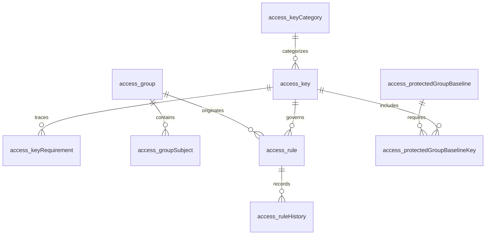

# Data Model: Controle de Acesso por Grupos e Chaves

## Convenções

- Todas as estruturas ficam em `rinos_global` e usam prefixo `access_`.
- PKs são `BIGINT AUTO_INCREMENT`; instantes são UTC; nomes físicos usam camelCase após o prefixo modular.
- `scopeType` aceita `GLOBAL` ou `TENANT`. `idTenant` é nulo somente no escopo global.
- Regras de tenant apontam para a associação do usuário à conta; regras globais apontam para a identidade.
- Exclusão física não é usada para registros que participam de auditoria.

## Entity: AccessKeyCategory (`access_keyCategory`)

| Field | Type | Constraints | Notes |
|-------|------|-------------|-------|
| `idAccessKeyCategory` | BIGINT | PK | identificador interno |
| `categoryCode` | VARCHAR(160) | UNIQUE, NOT NULL | código técnico estável |
| `parentIdAccessKeyCategory` | BIGINT | FK nullable | auto-relação sem ciclos |
| `scopeType` | VARCHAR(16) | NOT NULL | GLOBAL ou TENANT |
| `nameI18nKey` | VARCHAR(200) | NOT NULL | nome localizado |
| `descriptionI18nKey` | VARCHAR(200) | NOT NULL | descrição localizada |
| `displayOrder` | INT | NOT NULL | apenas apresentação |
| `status` | VARCHAR(24) | NOT NULL | ACTIVE ou INACTIVE |
| `version` | BIGINT | NOT NULL | optimistic lock |

Categoria não participa da decisão. Pai e filha precisam possuir o mesmo escopo.

## Entity: AccessKey (`access_key`)

| Field | Type | Constraints | Notes |
|-------|------|-------------|-------|
| `idAccessKey` | BIGINT | PK | |
| `accessKeyCode` | VARCHAR(200) | UNIQUE, NOT NULL | código interno imutável |
| `scopeType` | VARCHAR(16) | NOT NULL | GLOBAL ou TENANT |
| `idAccessKeyCategory` | BIGINT | FK, NOT NULL | categoria canônica |
| `ownerModule` | VARCHAR(100) | NOT NULL | módulo contributor |
| `nameI18nKey` | VARCHAR(200) | NOT NULL | não expõe código |
| `descriptionI18nKey` | VARCHAR(200) | NOT NULL | |
| `entitlementScope` | VARCHAR(16) | nullable | PERSONAL ou TENANT; obrigatório junto do código |
| `entitlementCode` | VARCHAR(200) | nullable | gate de plano, não regra ACL; nulo junto do escopo |
| `status` | VARCHAR(24) | NOT NULL | ACTIVE, INACTIVE |
| `descriptorVersion` | INT | NOT NULL | versão semântica compatível |
| `createdAt` / `updatedAt` | TIMESTAMP(6) | NOT NULL | UTC |

Referências aos requisitos consumidores ficam em `access_keyRequirement`, permitindo várias origens sem texto
concatenado. A condição de chave administrativa mínima não é atributo mutável da chave: ela decorre exclusivamente
da associação a uma versão de `ProtectedGroupBaseline`, evitando inclusão implícita de chave futura.

`scopeType=GLOBAL` não determina `entitlementScope`: operações pessoais e administrativas podem ser globais, mas
somente as primeiras declaram `PERSONAL`. A persistência rejeita escopo de entitlement sem código e código sem escopo.

## Entity: AccessKeyRequirement (`access_keyRequirement`)

| Field | Type | Constraints | Notes |
|-------|------|-------------|-------|
| `idAccessKeyRequirement` | BIGINT | PK | |
| `idAccessKey` | BIGINT | FK, NOT NULL | |
| `featureCode` | VARCHAR(100) | NOT NULL | diretório SDD |
| `requirementCode` | VARCHAR(100) | NOT NULL | ID rastreável |

Unique: (`idAccessKey`, `featureCode`, `requirementCode`).

## Entity: AuthorizationContextRevision (`access_contextRevision`)

| Field | Type | Constraints | Notes |
|-------|------|-------------|-------|
| `idAccessContextRevision` | BIGINT | PK | linha de guarda |
| `scopeType` | VARCHAR(16) | NOT NULL | |
| `idTenant` | BIGINT | nullable | obrigatório em TENANT |
| `revision` | BIGINT | NOT NULL | incremento transacional |
| `updatedAt` | TIMESTAMP(6) | NOT NULL | |

Unique funcional: uma linha global e uma linha por tenant. A linha também é bloqueada durante validação de
continuidade administrativa. Toda mutação capaz de alterar a resolução de qualquer sujeito do contexto incrementa a
revisão na mesma transação. A revisão é a autoridade de obsolescência entre instâncias; notificações apenas antecipam
descarte local e não substituem esta linha.

## Modelo não persistido: SubjectAccessSnapshot

O cache não cria tabela nem altera a fonte de verdade. Cada entrada imutável é identificada por:

- `(GLOBAL, identityId)` para sujeito humano global; ou
- `(TENANT, idTenant, idAccountMembership)` para sujeito humano de tenant.

O snapshot contém somente fontes diretas e de grupos necessárias ao sujeito, `contextRevision`, instante de carga,
próxima fronteira temporal conhecida e metadados mínimos de origem para decisão e explicação autorizada. Ele não contém
ACL completa do tenant, entidade JPA, decisão final, direito de plano, estado autenticativo nem garantia congelada.

O cache é local à instância e limitado por peso e inatividade. Uma entrada é inelegível quando sua revisão divergir,
quando alcançar a próxima fronteira temporal ou quando o carregamento não puder ser comprovado. A vigência das fontes é
reavaliada pelo relógio UTC em toda decisão, inclusive quando a revisão não mudou.

## Entity: AccessGroup (`access_group`)

| Field | Type | Constraints | Notes |
|-------|------|-------------|-------|
| `idAccessGroup` | BIGINT | PK | |
| `scopeType` | VARCHAR(16) | NOT NULL | |
| `idTenant` | BIGINT | nullable | contexto exato |
| `name` | VARCHAR(160) | NOT NULL | único normalizado no contexto |
| `normalizedName` | VARCHAR(160) | NOT NULL | busca/unique |
| `description` | VARCHAR(500) | nullable | |
| `status` | VARCHAR(24) | NOT NULL | ACTIVE, INACTIVE |
| `protectedGroup` | BOOLEAN | NOT NULL | impede exclusão comum |
| `baselineVersion` | INT | nullable | obrigatório quando protegido |
| `version` | BIGINT | NOT NULL | optimistic lock |
| `createdAt` / `updatedAt` | TIMESTAMP(6) | NOT NULL | |

Unique: (`scopeType`, `idTenant`, `normalizedName`). Grupos não possuem FK para outros grupos.

## Entity: ProtectedGroupBaseline (`access_protectedGroupBaseline`)

| Field | Type | Constraints | Notes |
|-------|------|-------------|-------|
| `idProtectedGroupBaseline` | BIGINT | PK | |
| `scopeType` | VARCHAR(16) | NOT NULL | GLOBAL ou TENANT |
| `baselineVersion` | INT | NOT NULL | versão explícita |
| `status` | VARCHAR(24) | NOT NULL | ACTIVE, SUPERSEDED |
| `createdAt` | TIMESTAMP(6) | NOT NULL | |

`access_protectedGroupBaselineKey` relaciona baseline e chave. Nenhuma chave futura é incluída implicitamente.

## Entity: AccessGroupSubject (`access_groupSubject`)

| Field | Type | Constraints | Notes |
|-------|------|-------------|-------|
| `idAccessGroupSubject` | BIGINT | PK | |
| `idAccessGroup` | BIGINT | FK, NOT NULL | |
| `idUser` | BIGINT | FK nullable | obrigatório para grupo global |
| `idAccountMembership` | BIGINT | FK nullable | obrigatório para grupo tenant |
| `status` | VARCHAR(24) | NOT NULL | ACTIVE, INACTIVE, ENDED |
| `validFrom` | TIMESTAMP(6) | nullable | inclusivo |
| `validUntil` | TIMESTAMP(6) | nullable | exclusivo |
| `createdByUserId` | BIGINT | FK nullable | nulo para origem sistêmica |
| `createdAt` / `updatedAt` | TIMESTAMP(6) | NOT NULL | |
| `version` | BIGINT | NOT NULL | optimistic lock |

Check: exatamente um dos sujeitos deve existir e corresponder ao escopo do grupo. Unique corrente impede associação
ativa duplicada entre o mesmo grupo e sujeito.

## Entity: AccessRule (`access_rule`)

| Field | Type | Constraints | Notes |
|-------|------|-------------|-------|
| `idAccessRule` | BIGINT | PK | |
| `scopeType` | VARCHAR(16) | NOT NULL | |
| `idTenant` | BIGINT | nullable | obrigatório em TENANT |
| `originType` | VARCHAR(24) | NOT NULL | DIRECT_USER, DIRECT_MEMBERSHIP, GROUP |
| `idUser` | BIGINT | FK nullable | origem direta global |
| `idAccountMembership` | BIGINT | FK nullable | origem direta tenant |
| `idAccessGroup` | BIGINT | FK nullable | origem de grupo |
| `idAccessKey` | BIGINT | FK, NOT NULL | mesma classe de escopo |
| `effect` | VARCHAR(16) | NOT NULL | PERMITIR, BLOQUEAR |
| `status` | VARCHAR(24) | NOT NULL | ACTIVE, INACTIVE |
| `validFrom` | TIMESTAMP(6) | nullable | inclusivo |
| `validUntil` | TIMESTAMP(6) | nullable | exclusivo |
| `createdByUserId` | BIGINT | FK nullable | |
| `updatedByUserId` | BIGINT | FK nullable | |
| `createdAt` / `updatedAt` | TIMESTAMP(6) | NOT NULL | |
| `version` | BIGINT | NOT NULL | optimistic lock |

Checks garantem exatamente uma origem compatível. Unique lógico garante uma regra corrente por origem, chave e
contexto. `validUntil <= validFrom` é inválido. Grupo protegido não aceita bloqueio de chave pertencente à baseline.

## Entity: AccessRuleHistory (`access_ruleHistory`)

| Field | Type | Constraints | Notes |
|-------|------|-------------|-------|
| `idAccessRuleHistory` | BIGINT | PK | |
| `idAccessRule` | BIGINT | FK, NOT NULL | identidade estável da regra |
| `changeType` | VARCHAR(32) | NOT NULL | CREATE, EFFECT_CHANGE, VALIDITY_CHANGE, DEACTIVATE |
| `previousSnapshot` | JSON | nullable | valores antes |
| `newSnapshot` | JSON | NOT NULL | valores depois |
| `actorUserId` | BIGINT | FK nullable | |
| `systemOrigin` | VARCHAR(100) | nullable | alternativa ao ator humano |
| `reason` | VARCHAR(500) | nullable | exigida em ações sensíveis |
| `correlationId` | VARCHAR(100) | NOT NULL | |
| `occurredAt` | TIMESTAMP(6) | NOT NULL | UTC |

## Relationships



Relações com `identity_user`, registro de tenant e associação de conta são de controle global. Elas usam integridade
física quando as tabelas existirem no mesmo schema; o módulo nunca cria relação global para dado físico de tenant.

## State Transitions

```text
AccessRule: ACTIVE <-> INACTIVE
AccessGroup: ACTIVE <-> INACTIVE
GroupSubject: ACTIVE -> INACTIVE | ENDED
Bootstrap: NEVER_COMPLETED -> COMPLETED
Protected baseline: ACTIVE -> SUPERSEDED
```

Troca de efeito não é transição de estado: é alteração versionada da regra corrente com evento `EFFECT_CHANGE`.
Regra expirada permanece `ACTIVE`, mas é inelegível pelo predicado de vigência.

## Índices e Integridade

- índice de decisão: contexto, sujeito/origem, status, vigência e chave;
- índice de grupos: contexto, sujeito, status e vigência;
- índice de explicação: contexto, chave, origem e instante de histórico;
- índice de auditoria: contexto, alvo e `occurredAt`;
- unique de código de chave e categoria;
- unique de baseline por escopo e versão;
- constraints de escopo impedem chave global em regra de tenant e o inverso;
- transação de mutação bloqueia `access_contextRevision` antes da validação de continuidade.
- a validação de continuidade avalia o instante corrente e cada fronteira futura conhecida de início ou término
  das regras, associações e fatores fortes relevantes; uma mudança não pode agendar um intervalo sem administrador
  mínimo apto.

## Dados iniciais

O init global cria o schema ACL, a revisão global `0` e o singleton de bootstrap nunca concluído. Durante a readiness
global, depois da migration e antes de liberar tráfego, o registry modular sincroniza transacionalmente as categorias,
as chaves da versão 1, seus requisitos exatos, a baseline global protegida e a baseline protegida do fundador de
tenant. Essa divisão mantém o catálogo em código como fonte canônica e evita duplicá-lo em SQL; falha, colisão ou
divergência de baseline interrompe a readiness. A criação de tenant instancia o grupo protegido local e associa o
fundador. A criação de regra é explícita e auditada. Nenhuma tabela de tenant é criada por esta feature.

O histórico é append-only e não participa diretamente da autorização.

## Entity: AccessBootstrap (`access_bootstrap`)

| Field | Type | Constraints | Notes |
|-------|------|-------------|-------|
| `idAccessBootstrap` | BIGINT | PK, CHECK = 1 | singleton global de chave fixa |
| `status` | VARCHAR(24) | NOT NULL | NEVER_COMPLETED ou COMPLETED |
| `completedByUserId` | BIGINT | FK nullable | administrador inicial |
| `completedAt` | TIMESTAMP(6) | nullable | |
| `correlationId` | VARCHAR(100) | nullable | auditoria |
| `version` | BIGINT | NOT NULL | trava otimista |

O init cria exatamente a linha `idAccessBootstrap = 1`; a PK fixa e a restrição `CHECK` impedem uma segunda linha.
O marcador diferencia instalação nunca inicializada de perda administrativa posterior. A recuperação excepcional
não altera este marcador.

## Classificação global do ator (`identity_user.globalActorRole`)

`globalActorRole` possui os valores `USER` e `SYSTEM_ADMINISTRATOR`. É uma classificação para apresentação,
auditoria e fluxos administrativos; não participa do algoritmo de autorização e não substitui regras ou grupos. O
bootstrap altera o valor para `SYSTEM_ADMINISTRATOR` na mesma transação que cria o grupo protegido, suas permissões
explícitas, o vínculo do usuário, a auditoria e o marcador permanente.

## Entity: AccessAuditEvent (`access_auditEvent`)

| Field | Type | Constraints | Notes |
|-------|------|-------------|-------|
| `idAccessAuditEvent` | BIGINT | PK | |
| `eventType` | VARCHAR(80) | NOT NULL | mutação, decisão sensível, bootstrap |
| `scopeType` / `idTenant` | VARCHAR/BIGINT | NOT NULL/nullable | contexto exato |
| `actorUserId` | BIGINT | FK nullable | ator humano |
| `systemOrigin` | VARCHAR(100) | nullable | ator sistêmico explícito |
| `targetType` / `targetId` | VARCHAR/BIGINT | NOT NULL | alvo auditado |
| `correlationId` | VARCHAR(100) | NOT NULL | rastreio ponta a ponta |
| `safeReasonCode` | VARCHAR(100) | nullable | sem detalhes sensíveis |
| `details` | JSON | nullable | payload minimizado |
| `occurredAt` | TIMESTAMP(6) | NOT NULL | UTC |
