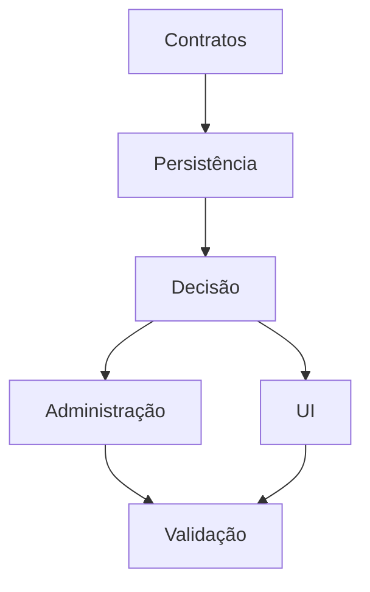

# Tarefas Rinos — Controle de Acesso

Escopo: implementar autorização por chaves, grupos, permissões e bloqueios nos contextos global e tenant.

**Legenda de status:** `[ ]` pendente, `[~]` em andamento, `[x]` concluído, `[!]` bloqueado.
**Criticidade:** `[C]` crítico, `[A]` alto, `[M]` médio.

## FASE 1 - Contratos e catálogo

### 1.1 Publicar contratos públicos `[C]`

Ref: `contracts/authorization.md`; FR-ACL-KEY-* e AUTHZ-*

- [x] 1.1.1 Criar VOs, enums e facade de autorização no módulo `api`.
- [x] 1.1.2 Criar descriptors tipados e contributor modular idempotente.
- [x] 1.1.3 Criar testes de validação de request, escopo e chaves vazias ou desconhecidas.

### 1.2 Sincronizar catálogo inicial `[C]`

Ref: `contracts/access-key-catalog.md`; FR-ACL-ADM-006

- [x] 1.2.1 Implementar registry global e validação de colisão semântica.
- [x] 1.2.2 Publicar contributors do núcleo e dos módulos já existentes.
- [x] 1.2.3 Testar inclusão compatível, inativação explícita e falha de readiness.

## FASE 2 - Schema global e persistência

### 2.1 Criar modelo relacional ACL `[C]`

Ref: `data-model.md`; FR-ACL-KEY-*, GRP-* e RULE-*

- [x] 2.1.1 Adicionar DDL init e update exclusivamente em `db/global`.
- [x] 2.1.2 Criar entities, repositories e constraints de escopo, origem e vigência.
- [x] 2.1.3 Criar testes MySQL para uniques, índices, histórico e dados iniciais.

### 2.2 Implementar revisão e auditoria `[C]`

Ref: `data-model.md`; FR-ACL-RULE-010 e EXP-005

- [x] 2.2.1 Persistir revisão monotônica por contexto e guarda transacional.
- [x] 2.2.2 Persistir histórico append-only e evento administrativo minimizado.
- [x] 2.2.3 Testar rollback atômico de regra, auditoria e revisão.

## FASE 3 - Núcleo de decisão

### 3.1 Resolver regras e precedência `[C]`

Ref: FR-ACL-AUTHZ-001..006; SC-ACL-002..008

- [x] 3.1.1 Carregar regra direta e de grupo pelo contexto e instante UTC.
- [x] 3.1.2 Implementar `PERMITIR` mais ausência de `BLOQUEAR` por chave.
- [x] 3.1.3 Testar matriz direta/grupo, múltiplos grupos, outro tenant e vigência.

### 3.2 Integrar gates externos `[C]`

Ref: FR-ACL-AUTHZ-007..012

- [x] 3.2.1 Integrar identidade, associação, contexto e conta operacional <!-- validado por MembershipPersistenceIT -->
- [x] 3.2.2 Integrar entitlement e garantia de autenticação sem misturar motivos <!-- validado por JdbcEntitlementEvaluationServiceIT e matriz unitária -->
- [x] 3.2.3 Testar operação composta, plano ausente, fator insuficiente e falha segura.

### 3.3 Criar cache revisionado `[C]`

Ref: `research.md`, Decision 8; SC-ACL-011, 016 e 019..021

- [x] 3.3.1 Implementar snapshot local imutável, limitado por peso/inatividade e indexado por sujeito mais contexto;
      aplicar revisão, vigência corrente e próxima fronteira temporal sem cachear decisão final.
- [x] 3.3.2 Consultar revisão por operação independente, permitir memoização somente na mesma operação composta,
      invalidar localmente após commit e manter notificação remota como otimização opcional.
- [x] 3.3.3 Testar duas instâncias, sujeitos/tenants distintos, revogação, início/expiração sem mutação, notificação
      perdida/fora de ordem, limites de memória e falha segura.

## FASE 4 - Administração e continuidade

### 4.1 Manter grupos, associações e regras `[C]`

Ref: FR-ACL-GRP-*, RULE-* e ADM-*

- [x] 4.1.1 Implementar comandos de grupo, sujeito e regra direta/de grupo.
- [x] 4.1.2 Implementar troca de efeito com uma regra corrente e histórico.
- [x] 4.1.3 Testar isolamento global/tenant, concorrência e exclusão lógica.

### 4.2 Proteger administração mínima `[C]`

Ref: FR-ACL-CONT-*; SC-ACL-010

- [x] 4.2.1 Implementar baseline de grupo protegido e administrador apto.
- [x] 4.2.2 Validar transacionalmente regra, grupo, associação, estado e fator forte <!-- estado da identidade usa a ordem canônica, flush e reavaliação -->
- [x] 4.2.3 Testar perda do último administrador, expiração futura e rollback <!-- concorrência identidade/regra validada no MySQL -->

### 4.3 Implementar bootstrap e origem sistêmica `[C]`

Ref: FR-ACL-BOOT-* e AUTHZ-011

- [x] 4.3.1 Implementar bootstrap único pelo e-mail configurado e TOTP confirmado.
  - Evidência: [enrollment obrigatório no ciclo de ativação da identidade fundadora](../user-registration/evidence/8.6/README.md).
- [x] 4.3.2 Implementar principal sistêmico tipado e auditoria de finalidade.
- [x] 4.3.3 Testar concorrência, alteração posterior da propriedade e repetição idempotente.

### 4.4 Publicar explicação administrativa `[A]`

Ref: FR-ACL-EXP-*; `contracts/authorization.md`

- [x] 4.4.1 Montar decisão por chave, origens, vigências e motivos de gate.
- [x] 4.4.2 Aplicar filtro de visibilidade por contexto e chave de explicação.
- [x] 4.4.3 Testar ausência, bloqueio, plano, 2FA e não divulgação cross-tenant.

## FASE 5 - Adapters e interface web

### 5.1 Integrar Spring, serviços e jobs `[C]`

Ref: FR-ACL-AUTHZ-008..018

- [x] 5.1.1 Implementar adapter Spring Security e helper de serviço que derivam ator/garantia da autenticação e recebem
      contexto explícito, sem chaves ou tenant ativo no principal ou sessão compartilhada.
- [x] 5.1.2 Aplicar reautorização antes de trabalho assíncrono iniciado por usuário.
- [x] 5.1.3 Testar rota, chamada interna, duas UIs da mesma sessão em tenants distintos, job revogado e operação
      sistêmica.

### 5.2 Implementar central e editor RFW `[A]`

Ref: INT-WEB-ACL-001..003

- [x] 5.2.1 Implementar central contextual com árvore, filtro e listas por nome.
- [x] 5.2.2 Implementar editor de grupo, matriz e regra direta com estados completos.
- [x] 5.2.3 Validar teclado, reflow, i18n, conflito de versão e ausência de códigos.

### 5.3 Implementar explicação e prévia `[A]`

Ref: INT-WEB-ACL-004..005

- [x] 5.3.1 Implementar painel de explicação seguro por chave e gate.
- [x] 5.3.2 Implementar dialog de prévia e reautenticação para mudança protegida.
- [x] 5.3.3 Validar foco, mensagens seguras e concorrência entre prévia e confirmação.

## FASE 6 - Integração de consumidores e quality gate

### 6.1 Migrar fundação e cadastros `[C]`

Ref: account-registration, membership, tenant-context, parties e payment-details

- [x] 6.1.1 Substituir verificações locais pelas chaves canônicas da fundação.
- [!] 6.1.2 Integrar pessoas, relacionamentos e dados sensíveis de pagamento. Bloqueada: os três domínios ainda possuem somente especificações; não há consumidor Java onde aplicar a autorização.
- [!] 6.1.3 Executar testes de permissão, bloqueio e isolamento para cada consumidor. Bloqueada pelos consumidores ausentes em 6.1.2.

### 6.2 Migrar financeiro por ondas `[C]`

Ref: catálogo financeiro; FR-ACL-AUTHZ-005

- [!] 6.2.1 Integrar contas, categorias, dimensões e lançamentos. Bloqueada: os módulos financeiros ainda não possuem implementação Java consumidora.
- [!] 6.2.2 Integrar transferências, títulos, cartões, recorrências e fechamento. Bloqueada: os módulos financeiros ainda não possuem implementação Java consumidora.
- [!] 6.2.3 Integrar extratos/conciliação e validar operações compostas sem efeito parcial. Bloqueada: os módulos financeiros ainda não possuem implementação Java consumidora.

### 6.3 Validar entrega `[C]`

Ref: checklists, quickstart e SC-ACL-*

- [!] 6.3.1 Executar matriz unitária, integração MySQL e cenários quickstart. Bloqueada: a matriz completa depende dos consumidores ainda inexistentes em 6.1.2 e 6.2.
- [!] 6.3.2 Medir separadamente leitura de revisão, hit/miss, resolução fria/quente, uso de memória e decisão em lote;
      documentar resultado contra as metas. Bloqueada: faltam metas e protocolo reproduzível de benchmark no SDD.
- [x] 6.3.3 Executar revisão de segurança, acessibilidade, build e análise cross-artifact.
      Evidência: `evidence/6.3.3/README.md`; a revisão abre as pendências 6.3.4 e 6.3.5, sem declarar entrega final
      enquanto elas permanecerem abertas.
- [!] 6.3.4 Executar validação manual reproduzível da central ACL e dos diálogos de explicação/prévia: teclado,
      ordem e retorno de foco, conteúdo de `aria-live`, reflow e leitor de tela. Bloqueada: em 2026-09-04 o artefato
      atual foi publicado e a tela pública de login foi reinspecionada; ainda falta uma sessão administrativa
      descartável e leitor de tela para concluir a validação real. Evidência e protocolo:
      `evidence/6.3.4/README.md`.
- [x] 6.3.5 Corrigir a oferta de enrollment por e-mail indevida nas configurações de segurança. A RFW oferece a
      API local `factorEnrollmentMethods(...)`, preservando TOTP e e-mail por padrão; o Rinos restringe sua tela a
      TOTP. A evolução possui testes, documentação e laboratório do showroom.

## Matriz de Dependências

Fase 1 depende de documentação aprovada. Fase 2 depende da Fase 1; Fase 3 depende da Fase 2; Fases 4 e 5 dependem da Fase 3; Fase 6 depende das Fases 4 e 5.

## Cobertura de Interfaces

| Surface ID | Coverage | Interaction IDs | Task IDs |
|------------|----------|-----------------|----------|
| `SURF-WEB-RINOS` | FULL | INT-WEB-ACL-001 | 5.2, 6.3 |
| `SURF-WEB-RINOS` | FULL | INT-WEB-ACL-002, INT-WEB-ACL-003 | 4.1, 4.2, 5.2, 6.3 |
| `SURF-WEB-RINOS` | FULL | INT-WEB-ACL-004, INT-WEB-ACL-005 | 4.2, 4.4, 5.3, 6.3 |

## Resumo Quantitativo

| Fase | Tarefas | Subtarefas | Criticidade |
|------|---------|------------|-------------|
| 1 - Contratos e catálogo | 2 | 6 | 2 C |
| 2 - Schema e persistência | 2 | 6 | 2 C |
| 3 - Núcleo de decisão | 3 | 9 | 3 C |
| 4 - Administração e continuidade | 4 | 12 | 3 C, 1 A |
| 5 - Adapters e interface | 3 | 9 | 1 C, 2 A |
| 6 - Consumidores e quality gate | 3 | 11 | 3 C |
| **Total** | **17** | **53** | **14 C, 3 A** |

## Escopo Coberto

| Item | Descrição | Fase |
|------|-----------|------|
| FR-ACL-KEY-* | catálogo, categorias e registro modular | 1, 2 |
| FR-ACL-GRP-* / RULE-* | grupos, sujeitos, regras, vigência e histórico | 2, 4 |
| FR-ACL-AUTHZ-* | decisão, bloqueio, gates, jobs e falha segura | 3, 5 |
| FR-ACL-CONT-* / BOOT-* | baseline, continuidade e bootstrap | 4 |
| FR-ACL-EXP-* | explicação e auditoria | 2, 4, 5 |
| INT-WEB-ACL-* | toda a superfície humana aprovada | 5 |
| SC-ACL-* | qualidade, isolamento e regressão | 3, 4, 6 |

## Escopo Excluído

| Item | Descrição | Motivo |
|------|-----------|--------|
| Curingas e políticas booleanas | regra por categoria, herança ou expressões arbitrárias | fora da versão definida |
| API REST pública | endpoints externos de ACL | não existe consumidor aprovado |
| Mudança RFW | matriz ou painel genérico no submódulo | lacuna ainda não comprovada como reutilizável |
| Deploy em produção | publicação operacional dos artefatos implementados | exige pipeline e autorização operacional próprios |
