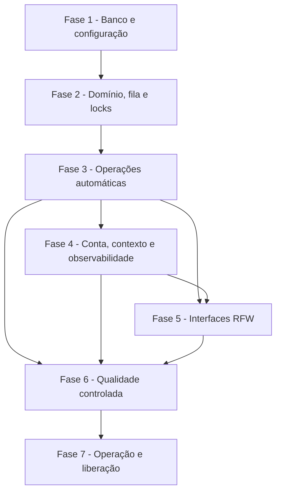

# Tarefas Rinos — Provisionamento do Armazenamento de Tenant

Escopo: implementar o registro global, o ciclo físico durável e idempotente, a atualização automática, os gates de prontidão e as jornadas web seguras do armazenamento exclusivo de tenants. Este backlog não cria backups, restauração, comandos manuais de migration nem acesso humano a detalhes de infraestrutura.

**Legenda de status:**

- `[ ]` Pendente
- `[~]` Em andamento
- `[x]` Concluído
- `[!]` Bloqueado

**Legenda de criticidade:**

- `[C]` Crítico - Impacto financeiro direto, regulatório, segurança, SLA ou operação bloqueante
- `[A]` Alto - Funcionalidade essencial
- `[M]` Médio - Necessário, mas sem urgência imediata

> [!IMPORTANT]
> A implementação começa somente com MySQL controlado por testes. O ambiente Turing não é laboratório para falhas de schema, permissões, concorrência ou migration. A ativação em produção exige a tarefa 7.2 e autorização específica para cada alteração operacional.

> [!NOTE]
> A autorização administrativa real depende da implementação de `access-control`. Até ela existir, pontos de operação global sensível devem negar por padrão; nenhuma role, flag ou UI pode substituí-la.

---

## FASE 1 - Fundação de banco, scripts e configuração

### 1.1 Configuração explícita e fronteira de credenciais `[C]`

Ref: [plan.md](./plan.md) §Contexto Técnico e §Segurança; [research.md](./research.md) Decisão 2; Spec FR-TSP-SEC-004..007.

- [x] 1.1.1 Declarar propriedades fixas `rinos.storage.*` no modelo e no binding tipado, com defaults documentados para fila, lease, heartbeat, tentativas e concorrência igual a um.
- [x] 1.1.2 Garantir que a fábrica de datasource derive somente o catálogo tenant da fonte `spring.datasource` já carregada, sem URL, usuário, senha, root ou variável de ambiente paralelos.
- [x] 1.1.3 Implementar validação fechada de URL/catalog e do formato interno do identificador físico antes de qualquer conexão tenant.
- [x] 1.1.4 Cobrir propriedades ausentes/inválidas, origem exclusiva da configuração e rejeição de identificador físico malformado em testes unitários.

### 1.2 Registro global e auditoria do armazenamento `[C]`

Ref: [data-model.md](./data-model.md) §`storage_*`; Spec FR-TSP-ID-001..008, STATE-001..005, OPS-001..006.

- [x] 1.2.1 Criar migration em `db/global/update/` para `storage_tenantRegistry`, operações, etapas, histórico de migration, transições e auditoria, com FKs e índices somente no schema global.
- [x] 1.2.2 Implementar entidades, enums, value objects, repositórios e mapeamentos JPA no contexto `storage`, preservando convenções de UUID e `snake_case`.
- [x] 1.2.3 Materializar as restrições de uma localização por tenant, não reutilização do identificador físico, uma operação estrutural ativa por tenant e idempotência por intenção.
- [x] 1.2.4 Testar a migration e invariantes contra MySQL controlado, incluindo conflito de reserva, transição inválida e auditoria sem segredo.

### 1.3 Scripts de tenant e versão estrutural `[C]`

Ref: [docs/architecture/database-scripts.md](../../architecture/database-scripts.md); [plan.md](./plan.md) §Fluxos Estruturais; Spec FR-TSP-PROV-003..005 e MIG-001..005.

- [x] 1.3.1 Criar a estrutura inicial mínima em `db/tenant/init/`, com marcador de versão e dados técnicos estáveis requeridos para um tenant vazio.
- [x] 1.3.2 Configurar o resolvedor de locations de tenant para entregar exclusivamente `db/tenant/update/` ao RFW, nunca locations global ou init durante update.
- [x] 1.3.3 Implementar a verificação de versão, checksum e lacunas para bloquear tenant ausente, adulterado, desconhecido ou incompatível.
- [x] 1.3.4 Validar criação do zero e caminho equivalente de updates contra MySQL controlado, sem modificar schema de produção.

---

## FASE 2 - Domínio durável, fila e exclusividade

### 2.1 Máquina de estados e projeções seguras `[C]`

Ref: [plan.md](./plan.md) §Arquitetura de Componentes e §Fluxos Estruturais; Spec FR-TSP-STATE-001..010 e PROV-013..014.

- [x] 2.1.1 Implementar a máquina explícita de estados, etapas e resultados, rejeitando regressões, saltos e promoção manual para pronto.
- [x] 2.1.2 Separar a projeção interna/administrativa do resumo público `WAITING`, `PREPARING`, `READY` e `ATTENTION` usado pelo criador.
- [x] 2.1.3 Implementar `TenantStorageReadinessPort` como gate de segurança, sem transportar autorização nem expor localização física.
- [x] 2.1.4 Cobrir todas as transições permitidas/proibidas, quarantena, versão incompatível e filtragem de informações técnicas em testes unitários.

### 2.2 Reserva idempotente e contratos de operação `[C]`

Ref: [contracts/tenant-storage-provisioning.md](./contracts/tenant-storage-provisioning.md) §Solicitação e §Gate; Spec FR-TSP-PROV-001..009 e INFRA-IDEMP.

- [x] 2.2.1 Implementar `TenantProvisioningRequestPort` real para reservar tenant, identificador físico e operação antes de criação de schema.
- [x] 2.2.2 Preservar protocolo, correlação e referência idempotente em replay, concorrência e reinício sem reservar segundo storage.
- [x] 2.2.3 Publicar os DTOs/ports de status, readiness e eventos internos com erros seguros, sem expor schema, URL, SQL ou credencial.
- [x] 2.2.4 Criar testes de concorrência e replay que comprovem no máximo uma reserva física por intenção.

### 2.3 Despachante durável, leases e locks distribuídos `[C]`

Ref: [plan.md](./plan.md) §Transações, Concorrência e Falhas; Spec FR-TSP-PROV-011..012, MIG-006..007, INFRA-SCHED/LOCK/RECOVERY.

- [x] 2.3.1 Implementar consulta FIFO da fila global e aquisição transacional de lease por operação, respeitando prioridade das migrations já enfileiradas.
- [x] 2.3.2 Integrar o worker somente à instância de manutenção eleita, com heartbeat, retomada de lease vencido e limite configurável de concorrência igual a um por padrão.
- [x] 2.3.3 Usar lock nomeado do RFW/MySQL por tenant e liberar recursos em sucesso, falha ou abandono controlado.
- [x] 2.3.4 Testar duas instâncias simuladas, lease expirado, ordenação migration-before-provisioning e exclusividade por tenant.

---

## FASE 3 - Operações estruturais automáticas

### 3.1 Criação, init e retomada do tenant `[C]`

Ref: [plan.md](./plan.md) §Provisionamento; [quickstart.md](./quickstart.md) Cenários 1..3; Spec FR-TSP-PROV-002..017 e REC-001..013.

- [x] 3.1.1 Implementar `TenantSchemaInitializer` para criar exclusivamente `rinos_<physicalIdentifier>`, validar existência e executar `db/tenant/init/` de forma idempotente.
- [x] 3.1.2 Confirmar cada etapa em transação global própria, revalidar efeito após perda de resposta e manter dados iniciais de identidade estável.
- [ ] 3.1.3 Classificar falhas transitórias, repetir no máximo o limite configurado e colocar em `ATTENTION`/quarentena ao esgotar, sem excluir schema parcial.
- [ ] 3.1.4 Executar testes de integração para sucesso, espaço/DDL indisponível simulado, reinício, replay e nenhuma duplicidade de dados iniciais.

### 3.2 Atualização automática no deploy `[C]`

Ref: [plan.md](./plan.md) §Migration no deploy; [research.md](./research.md) Decisões 3 e 5; Spec FR-TSP-MIG-001..023.

- [ ] 3.2.1 Integrar o startup: RFW atualiza o global primeiro e a aplicação só fica operacional após compatibilidade global verificável.
- [ ] 3.2.2 Enfileirar migrations pendentes de tenants e invocar o orquestrador RFW com datasource/location isolados por tenant.
- [ ] 3.2.3 Registrar execução, versão anterior/resultante, checksum, início/fim e resultado; falha de migration deve quarantinar apenas o tenant e nunca receber retry ou rollback interno.
- [ ] 3.2.4 Testar ordem, execução única, falha isolada, bloqueio global e incompatibilidade após restauração externa simulada.

### 3.3 Reconciliação segura e desativação controlada `[A]`

Ref: [plan.md](./plan.md) §Retomada e desativação; Spec FR-TSP-REC-007..010, LIFE-001..006 e SEC-001..008.

- [ ] 3.3.1 Detectar registro sem schema, schema sem registro e falta de progresso sem adotar, remover ou marcar pronto automaticamente.
- [ ] 3.3.2 Implementar comando interno auditável de reconciliação e desativação idempotente, protegido por autorização global, reautenticação e 2FA quando `access-control` estiver disponível.
- [ ] 3.3.3 Negar por padrão qualquer ação administrativa sensível enquanto a integração de autorização canônica não existir; não usar papel como substituto.
- [ ] 3.3.4 Testar divergência, retenção/cancelamento sem delete automático, não reutilização e negação de ação sem garantia forte.

---

## FASE 4 - Integração com conta, contexto e observabilidade

### 4.1 Saga de criação da conta e gate de uso `[C]`

Ref: [docs/specs/account-registration/plan.md](../account-registration/plan.md); Spec FR-TSP-STATE-006, PROV-015..017 e BOUND-001..004.

- [ ] 4.1.1 Conectar a intenção já persistida de `account-registration` ao provisionamento sem ativar a conta no mesmo passo.
- [ ] 4.1.2 Coordenar confirmação de storage, associação fundadora, grupo/concessões mínimos e plano padrão, ativando a conta somente depois dos gates respectivos.
- [ ] 4.1.3 Integrar seleção/contexto de tenant para negar uso quando readiness não for `READY` e compatível, preservando a separação entre storage, ACL e entitlement.
- [ ] 4.1.4 Validar saga interrompida, fundador bloqueado, cancelamento em criação e que prontidão física não anuncia ativação prematura.

### 4.2 Auditoria, alertas e diagnóstico seguro `[A]`

Ref: [plan.md](./plan.md) §Observabilidade; Spec FR-TSP-OPS-001..008 e SEC-007.

- [ ] 4.2.1 Emitir auditoria/evidência estruturada para ator ou origem sistêmica, tenant, protocolo, etapa, versão, tentativa e resultado.
- [ ] 4.2.2 Sinalizar falta de progresso, falha, divergência e negação de ação sem vazar schema, host, SQL, stack trace, credencial ou dados funcionais.
- [ ] 4.2.3 Adicionar métricas de fila, duração, leases, compatibilidade e tenants em quarantena, com limites configuráveis e sem cardinalidade por identificador sensível.
- [ ] 4.2.4 Testar logs/eventos seguros e alertas uma vez por ocorrência relevante, incluindo falha de worker e erro de autorização.

---

## FASE 5 - Interfaces web RFW

### 5.1 Acompanhamento seguro da criação `[A]`

Ref: [interface-spec.md](./interface-spec.md) INT-WEB-TSP-001; [wireframes/creation-status.md](./wireframes/creation-status.md); Spec FR-TSP-PROV-010..014.

- [ ] 5.1.1 Integrar a confirmação/replay da conta ao painel de acompanhamento do criador usando somente APIs públicas RFW e `AccountCreationFacade.status`.
- [ ] 5.1.2 Renderizar apenas os quatro estados públicos, última atualização e orientação segura, sem ações de retry/correção/migration ou detalhes técnicos.
- [ ] 5.1.3 Implementar carregamento, estado obsoleto, erro remoto, teclado, foco, região viva, localização e reflow previstos na especificação.
- [ ] 5.1.4 Validar visualmente os form factors definidos, acessibilidade e que protocolo de outro usuário não revela informação.

### 5.2 Inventário e detalhe global seguro `[A]`

Ref: [interface-spec.md](./interface-spec.md) INT-WEB-TSP-002..003; [wireframes/storage-inventory.md](./wireframes/storage-inventory.md); Spec FR-TSP-OPS-003..008 e SEC-001..008.

- [ ] 5.2.1 Implementar inventário global paginado, filtros tipados, estado seguro, versão resumida, alerta e preservação de critérios exclusivamente com componentes RFW/Vaadin aprovados.
- [ ] 5.2.2 Implementar detalhe com histórico permitido e dialog de ação futura, sem botão de migration, backup, restauração, retry técnico ou promoção manual.
- [ ] 5.2.3 Integrar a autorização canônica e garantias fortes assim que `access-control` disponibilizar as chaves; até então omitir a entrada e negar a facade.
- [ ] 5.2.4 Cobrir autorização, vazio, stale, erro remoto, teclado, foco e inspeção visual conforme wireframe e interface spec.

---

## FASE 6 - Qualidade, isolamento e validação controlada

### 6.1 Suite MySQL controlada `[C]`

Ref: [quickstart.md](./quickstart.md); [README.md](../../../README.md#uso-seguro-de-uma-instância-mysql-9-existente); [database-scripts.md](../../architecture/database-scripts.md); Spec SC-TSP-001..008 e 014..015.

- [ ] 6.1.1 Criar fixtures de schemas temporários `rinos_test_<uuid>` e limpeza segura por nomes previamente validados, sem tocar `rinos_global`, schemas de tenant ou schemas de usuário.
- [ ] 6.1.2 Verificar empiricamente o conjunto mínimo de grants do usuário da aplicação para criação, init, DDL, DML e update de schemas `rinos\_%`, sem root ou `GRANT OPTION`.
- [ ] 6.1.3 Executar cenários de concorrência, fila, restart, init, migration, checksum e isolamento multi-tenant em MySQL 9 controlado.
- [ ] 6.1.4 Registrar evidência reproduzível, tempo de provisionamento de referência e limitações sem inserir segredo nos relatórios.

### 6.2 Segurança e regressão end-to-end `[C]`

Ref: [checklists/security.md](./checklists/security.md); [checklists/requirements.md](./checklists/requirements.md); Spec SC-TSP-002..007 e 009..013.

- [ ] 6.2.1 Cobrir negação fechada de tenant ausente, divergente, migrando, incompatível e restaurado externamente.
- [ ] 6.2.2 Cobrir falha isolada de tenant, falha global bloqueante, sem retry de migration e impossibilidade de comando humano estrutural.
- [ ] 6.2.3 Cobrir vazamento negativo em DTOs, exceções, auditoria, logs e telas, incluindo nome físico, host, SQL e credenciais.
- [ ] 6.2.4 Rodar `mvn verify`, verificadores de scripts/documentação aplicáveis e revisão de diff antes de marcar as tarefas críticas concluídas.

### 6.3 Verificação de interface e experiência `[A]`

Ref: [checklists/interface.md](./checklists/interface.md); [interface-spec.md](./interface-spec.md) §Validation Summary; Spec SC-TSP-012 e SC-TSP-016.

- [ ] 6.3.1 Executar testes de componente/integração das três interações com dados reais de facade e sem mocks que ocultem autorização ou sanitização.
- [ ] 6.3.2 Inspecionar as duas telas obrigatórias nos form factors previstos e registrar a evidência de conformidade visual.
- [ ] 6.3.3 Validar navegação por teclado, foco, regiões vivas, contraste não dependente de cor e localização de data/hora/duração.
- [ ] 6.3.4 Reexecutar o validador de `interface-spec.md` e atualizar documentação se implementação revelar lacuna genérica da RFW, sem alterar o submódulo sem autorização.

---

## FASE 7 - Operação e liberação controlada

### 7.1 Runbook, deploy e limites operacionais `[A]`

Ref: [README.md](../../../README.md); [docs/architecture/database-scripts.md](../../architecture/database-scripts.md); Spec FR-TSP-MIG-015..020 e INFRA-BACKUP.

- [ ] 7.1.1 Atualizar documentação de instalação e operação com ordem global/tenant, indisponibilidade esperada, conta de aplicação com menor privilégio e procedimento externo de falha.
- [ ] 7.1.2 Documentar diagnóstico de tenant em quarentena, evidências a coletar e limites explícitos: sem backup, restauração, migration manual ou rollback pela aplicação.
- [ ] 7.1.3 Preparar checklist de release com backup de responsabilidade externa, compatibilidade dos scripts, observação de fila e critério de abortar antes de deploy.
- [ ] 7.1.4 Revisar documentos privados operacionais sem versionar segredos, mantendo apenas fatos de infraestrutura necessários ao operador autorizado.

### 7.2 Liberação progressiva no Turing `[C]`

Ref: [PRIVATE-README.md](../../../PRIVATE-README.md) (não versionado); Spec SC-TSP-008, SC-TSP-013..015.

- [ ] 7.2.1 Solicitar autorização explícita antes de cada alteração em Turing, validar artefato, configuração, grants e capacidade sem reiniciar serviços fora do plano aprovado.
- [ ] 7.2.2 Aplicar migrations globais no deploy automatizado e verificar que falha global mantém o bloqueio operacional esperado.
- [ ] 7.2.3 Criar somente tenant de validação autorizado, observar logs/métricas/auditoria e confirmar que nenhum dado técnico aparece na UI pública.
- [ ] 7.2.4 Registrar resultado do smoke test, versão implantada, rollback externo aplicável e atualizar o backlog sem expor segredo ou dados privados.

---

## Matriz de Dependências

| Dependência externa | Impacto | Tratamento |
|---------------------|---------|------------|
| Implementação de `access-control` | chaves administrativas reais nas tarefas 3.3 e 5.2 | negar por padrão e não liberar ação até a integração canônica |
| Associação fundadora, grupo inicial e plano | ativação final da conta na tarefa 4.1 | storage fica pronto sem ativar a conta até os gates existentes estarem disponíveis |
| MySQL 9 controlado | tarefas 1.2, 1.3, 3.x e 6.1 | usar somente schemas temporários com prefixo e limpeza validada |
| Autorização operacional Turing | tarefa 7.2 | nunca presumir autorização de alteração, restart ou schema em produção |

## Cobertura de Interfaces

| Surface ID | Coverage | Interaction IDs | Task IDs |
|------------|----------|-----------------|----------|
| SURF-WEB-RINOS | PARTIAL | INT-WEB-TSP-001 | 5.1, 6.3 |
| SURF-WEB-RINOS | PARTIAL | INT-WEB-TSP-002 | 5.2, 6.3 |
| SURF-WEB-RINOS | PARTIAL | INT-WEB-TSP-003 | 5.2, 6.3 |

## Resumo Quantitativo

| Fase | Tarefas | Subtarefas | Criticidade |
|------|---------|------------|-------------|
| 1 - Fundação de banco, scripts e configuração | 3 | 12 | C |
| 2 - Domínio durável, fila e exclusividade | 3 | 12 | C |
| 3 - Operações estruturais automáticas | 3 | 12 | C/A |
| 4 - Integração com conta, contexto e observabilidade | 2 | 8 | C/A |
| 5 - Interfaces web RFW | 2 | 8 | A |
| 6 - Qualidade, isolamento e validação controlada | 3 | 12 | C/A |
| 7 - Operação e liberação controlada | 2 | 8 | C/A |
| **Total** | **18** | **72** | - |

## Escopo Coberto

| Item | Descrição | Fase |
|------|-----------|------|
| FR-TSP-ID/STATE | identidade física, estado, prontidão e quarantena | 1, 2 |
| FR-TSP-PROV/REC | reserva, fila, init, retomada e idempotência | 2, 3 |
| FR-TSP-MIG | migrations global/tenant automáticas e isoladas | 1, 3 |
| FR-TSP-LIFE/SEC/OPS | desativação protegida, auditoria, alertas e inventário | 3, 4, 5 |
| Interfaces | acompanhamento do criador, inventário e detalhe | 5, 6 |
| Operação | testes MySQL, runbook e liberação autorizada | 6, 7 |

## Escopo Excluído

| Item | Descrição | Motivo |
|------|-----------|--------|
| Backup e restauração | criação, agenda, teste, inventário e restauração de backups | procedimentos exclusivos da infraestrutura |
| Migration manual | botão, endpoint ou terminal humano para executar, repetir ou pular migration | deploy automático e solução externa de falha |
| Transferência de tenant | mover dados entre contas/localizações por fluxo de produto | depende de `tenant-data-governance` futuro |
| Administração por papel | permitir ações estruturais somente por ser administrador | viola autorização explícita e a dependência de `access-control` |
| Mudança no RFW | nova API ou componente do submódulo | nenhuma lacuna aprovada nesta especificação; proposta separada exigiria autorização |
