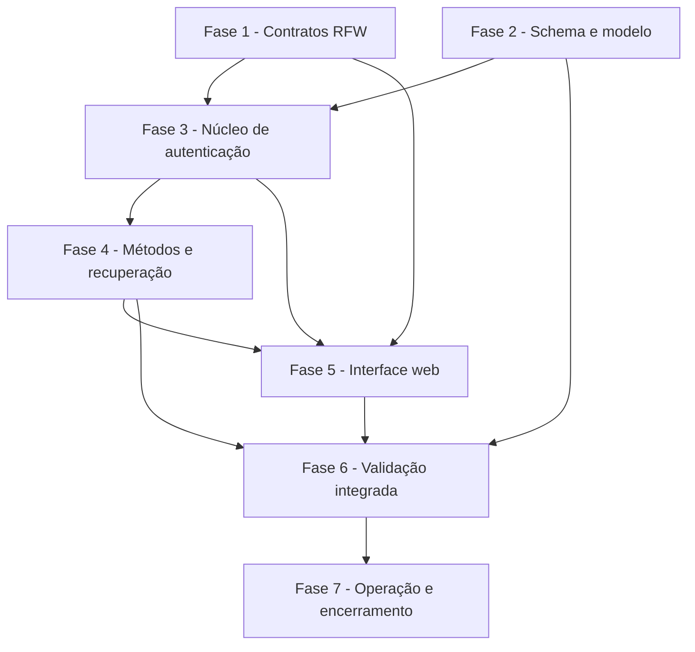

# Tarefas Rinos - Autenticação e Recuperação do Usuário

Escopo: implementar autenticação global por senha, passkey e Google, MFA, recuperação, sessões revogáveis, gate legal e gestão de segurança sobre a RFW Platform.

**Origem**: [spec.md](./spec.md), [plan.md](./plan.md), [interface-spec.md](./interface-spec.md) e [quality gate](./checklists/requirements.md).

**Legenda de status:**

- `[ ]` Pendente
- `[~]` Em andamento
- `[x]` Concluído
- `[!]` Bloqueado

**Legenda de criticidade:**

- `[C]` Crítico - Impacto direto em segurança, identidade, compliance ou operação bloqueante
- `[A]` Alto - Funcionalidade essencial para concluir a feature
- `[M]` Médio - Necessário, mas adiável sem impedir o fluxo principal

> [!IMPORTANT]
> Cada tarefa do RFW é um ciclo próprio: código, testes, documentação multilíngue no showroom, validação isolada,
> commit e push no repositório RFW, seguidos por atualização rastreável do ponteiro no Rinos.

## Constitution Alignment

| Princípio | Aplicação obrigatória no backlog |
|-----------|-----------------------------------|
| I. Isolamento Multi-Tenant | Toda persistência desta feature permanece global; nenhuma tarefa introduz contexto implícito de tenant |
| II. Autorização Contextual | Sessão e garantia não criam papel, grupo, chave ou authority; rotas autenticadas continuam deny-by-default |
| III. Integridade e Rastreabilidade | Fases 2–4 exigem migrations versionadas, locks, idempotência, auditoria e falha fechada |
| IV. Arquitetura RFW | Fase 1 encerra cada lacuna reutilizável no RFW antes da UI correspondente, com ciclo próprio de publicação |
| V. Qualidade Antes de Escopo | Toda tarefa de implementação contém teste; fases 6–7 bloqueiam conclusão com gate falho |

Não há exceção constitucional planejada.

---

## FASE 1 - Evoluções reutilizáveis da RFW Platform

### 1.1 Orquestrar conclusão WebAuthn pelo fluxo de acesso `[C]`

Ref: [RFW Gap Analysis AUTH-RFW-001](./rfw-gap-analysis.md#gap-auth-rfw-001-conclusão-webauthn-contorna-a-orquestração-do-acesso), Interface INT-WEB-AUTH-001/002/003

- [x] 1.1.1 Definir outcome público que entregue assertion validada à orquestração sem publicar sessão diretamente
- [x] 1.1.2 Adaptar componente/endpoints WebAuthn preservando login descobrível e compatibilidade explícita
- [x] 1.1.3 Cobrir sucesso, challenge adicional, gate legal, cancelamento, rejeição e replay em testes RFW
- [x] 1.1.4 Atualizar showroom, laboratório, i18n e documentos PT/EN/ES/FR/IT/ZH
- [x] 1.1.5 Validar, commitar e publicar o RFW; atualizar e publicar separadamente o ponteiro no Rinos

### 1.2 Entregar provisionamento tipado de TOTP `[C]`

Ref: [RFW Gap Analysis AUTH-RFW-002](./rfw-gap-analysis.md#gap-auth-rfw-002-enrollment-totp-não-devolve-dados-de-provisionamento), Interface INT-WEB-AUTH-006

- [x] 1.2.1 Criar VO público de enrollment com referência, URI `otpauth`, segredo de apresentação única e validade
- [x] 1.2.2 Evoluir provider/componente para confirmar ou cancelar enrollment sem reexibir segredo confirmado
- [x] 1.2.3 Testar lifecycle, descarte, erro, apresentação única e compatibilidade sem provider
- [x] 1.2.4 Documentar QR acessível, alternativa textual e exemplo no showroom em todos os idiomas suportados
- [x] 1.2.5 Validar, commitar e publicar o RFW; atualizar e publicar separadamente o ponteiro no Rinos

### 1.3 Modelar emissão, seleção e reenvio de fator por e-mail `[C]`

Ref: [RFW Gap Analysis AUTH-RFW-003](./rfw-gap-analysis.md#gap-auth-rfw-003-fator-por-e-mail-não-possui-emissão-seleção-e-reenvio), Interface INT-WEB-AUTH-002/006

- [x] 1.3.1 Definir contratos begin/resend com referência opaca, destino mascarado, validade e limite
- [x] 1.3.2 Integrar seleção explícita e troca de método ao renderer de challenge sem envio automático
- [x] 1.3.3 Testar reenvio, invalidação do código anterior, cooldown, indisponibilidade e métodos independentes
- [x] 1.3.4 Atualizar showroom, laboratório, i18n e documentação multilíngue do protocolo
- [x] 1.3.5 Validar, commitar e publicar o RFW; atualizar e publicar separadamente o ponteiro no Rinos

### 1.4 Generalizar reautenticação por método e garantia `[C]`

Ref: [RFW Gap Analysis AUTH-RFW-004](./rfw-gap-analysis.md#gap-auth-rfw-004-reautenticação-aceita-somente-uma-prova-textual), Interface INT-WEB-AUTH-010

- [x] 1.4.1 Substituir prova textual/boolean por operação, catálogo de métodos e outcome tipados
- [x] 1.4.2 Suportar senha, TOTP e passkey com continuação de uso único e cancelamento sem efeito
- [x] 1.4.3 Testar garantia já recente, challenge, expiração, conflito, passwordless e compatibilidade
- [x] 1.4.4 Atualizar diálogo/laboratório, i18n e documentação multilíngue do showroom
- [x] 1.4.5 Validar, commitar e publicar o RFW; atualizar e publicar separadamente o ponteiro no Rinos

### 1.5 Completar lifecycle de login persistente `[C]`

Ref: [RFW Gap Analysis AUTH-RFW-005](./rfw-gap-analysis.md#gap-auth-rfw-005-lifecycle-de-lembrar-me-é-incompleto), Plan §Session and Remember-me Strategy

- [x] 1.5.1 Definir contrato de criação, resolução, rotação, revogação e limpeza de cookie persistente
- [x] 1.5.2 Integrar hooks ao início e término da sessão sem expor selector, validator ou `HttpSession` ID
- [x] 1.5.3 Testar restauração válida, rotação, replay, expiração, bloqueio e provider ausente
- [x] 1.5.4 Documentar segurança do lifecycle e exemplos no showroom em todos os idiomas suportados
- [x] 1.5.5 Validar, commitar e publicar o RFW; atualizar e publicar separadamente o ponteiro no Rinos

### 1.6 Integrar sessão global à publicação e ao logout `[C]`

Ref: [RFW Gap Analysis AUTH-RFW-006](./rfw-gap-analysis.md#gap-auth-rfw-006-sessão-global-não-participa-da-publicação-e-do-logout), Interface INT-WEB-AUTH-009

- [x] 1.6.1 Criar lifecycle host para preparar, publicar, validar e encerrar sessão global
- [x] 1.6.2 Garantir compensação/falha fechada quando sessão global ou contexto local não puderem ser concluídos
- [x] 1.6.3 Testar login, logout, revogação externa, usuário bloqueado e falhas parciais
- [x] 1.6.4 Atualizar showroom, laboratório, i18n e documentação multilíngue da integração
- [x] 1.6.5 Validar, commitar e publicar o RFW; atualizar e publicar separadamente o ponteiro no Rinos

### 1.7 Acrescentar gate legal pós-autenticação `[C]`

Ref: [RFW Gap Analysis AUTH-RFW-007](./rfw-gap-analysis.md#gap-auth-rfw-007-gate-legal-pós-login-não-possui-etapa-própria), Interface INT-WEB-AUTH-003

- [x] 1.7.1 Definir continuação legal tipada com documentos pendentes, aceite e cancelamento
- [x] 1.7.2 Integrar etapa antes do callback autenticado sem afetar cadastro/aceites já existentes
- [x] 1.7.3 Testar catálogo vazio, nova versão concorrente, falha de integridade e ausência de sessão parcial
- [x] 1.7.4 Documentar renderer, exemplo e conteúdo multilíngue no showroom
- [x] 1.7.5 Validar, commitar e publicar o RFW; atualizar e publicar separadamente o ponteiro no Rinos

### 1.8 Tipar resultados e invariantes da gestão de segurança `[C]`

Ref: [RFW Gap Analysis AUTH-RFW-008](./rfw-gap-analysis.md#gap-auth-rfw-008-gestão-não-comunica-resultados-e-invariants-de-forma-suficiente), Interface INT-WEB-AUTH-005..009

- [x] 1.8.1 Definir outcomes públicos para listar, adicionar, renomear, remover, revogar e regenerar
- [x] 1.8.2 Representar conflito, último método, garantia insuficiente, estado stale e refresh obrigatório
- [x] 1.8.3 Testar seções independentes, operações idempotentes, erros e providers opcionais
- [x] 1.8.4 Atualizar showroom, laboratório, i18n e documentação multilíngue da gestão
- [x] 1.8.5 Validar, commitar e publicar o RFW; atualizar e publicar separadamente o ponteiro no Rinos

### 1.9 Tornar passkeys acessíveis e observáveis na UI `[A]`

Ref: [RFW Gap Analysis AUTH-RFW-009](./rfw-gap-analysis.md#gap-auth-rfw-009-componente-de-passkey-precisa-de-acessibilidade-e-estado-de-falha-tipado), Interface INT-WEB-AUTH-001/007

- [x] 1.9.1 Publicar eventos tipados para início, sucesso, cancelamento, indisponibilidade e rejeição WebAuthn
- [x] 1.9.2 Corrigir busy, foco, anúncio acessível, texto i18n e preservação de método alternativo
- [x] 1.9.3 Testar teclado, leitor de tela, cancelamento, navegador incompatível e erro remoto
- [x] 1.9.4 Atualizar laboratório visual e documentação multilíngue do showroom
- [x] 1.9.5 Validar, commitar e publicar o RFW; atualizar e publicar separadamente o ponteiro no Rinos

### 1.10 Adicionar gestão de senha local às configurações `[C]`

Ref: [RFW Gap Analysis AUTH-RFW-010](./rfw-gap-analysis.md#gap-auth-rfw-010-configurações-de-segurança-não-gerenciam-senha-local), Interface INT-WEB-AUTH-005/008

- [x] 1.10.1 Criar seção, provider, VOs e outcomes para estado, criação e alteração de senha
- [x] 1.10.2 Integrar reautenticação, validações por campo e capability opcional sem receber hash
- [x] 1.10.3 Testar usuário passwordless, senha comprometida, conflito, último método e provider ausente
- [x] 1.10.4 Atualizar laboratório, i18n e documentação multilíngue do showroom
- [x] 1.10.5 Validar, commitar e publicar o RFW; atualizar e publicar separadamente o ponteiro no Rinos

---

## FASE 2 - Schema global, modelo e configuração

### 2.1 Criar migrations globais de autenticação `[C]`

Ref: [Data Model](./data-model.md), Spec §Decisões de Infraestrutura Auditáveis

- [x] 2.1.1 Criar update SQL para fluxos, métodos, provas, fatores, recovery codes, passkeys, sessões e janelas
- [x] 2.1.2 Atualizar init global com o estado consolidado sem alterar scripts incrementais já publicados
- [x] 2.1.3 Definir FKs, UKs, índices, checks, versões otimistas e ações referenciais do modelo aprovado
- [x] 2.1.4 Atualizar marco da versão do schema global e documentação de migração
- [x] 2.1.5 Validar init limpo e update sobre schema anterior no MySQL 9 local
- [x] 2.1.6 Criar testes de metadados, constraints, concorrência e compatibilidade JPA

### 2.2 Implementar fluxos, provas e auditoria persistentes `[C]`

Ref: Data Model §AuthenticationFlow, §AuthenticationFlowMethod, §AuthenticationProof e §IdentityEvent Evolution

- [x] 2.2.1 Criar enums/entities de fluxo, método e prova com estados e transições fechadas
- [x] 2.2.2 Criar repositories com consultas bloqueantes para consumo e expiração atômicos
- [x] 2.2.3 Evoluir eventos de identidade append-only sem segredos ou origem indevida
- [x] 2.2.4 Criar services de emissão, inspeção, consumo, cancelamento e limpeza
- [x] 2.2.5 Expor DTOs/VOs/facades opacos sem entities na API pública interna
- [x] 2.2.6 Testar lifecycle, finalidade, replay, concorrência e auditoria sanitizada

> [!IMPORTANT]
> O ciclo implementado adota a ordem única de lock `AuthenticationFlow` → `AuthenticationProof`.
> A referência bruta do fluxo é devolvida somente na emissão; o banco recebe seu SHA-256 e provas
> específicas recebem apenas digest protegido. Expiração é lógica no primeiro acesso ou manutenção,
> e a remoção física ocorre somente depois do limite de retenção informado pelo coordenador.

### 2.3 Implementar persistência dos métodos e fatores `[C]`

Ref: Data Model §TotpFactor, §EmailFactor, §RecoveryCodeSet, §RecoveryCode, §PasskeyUser e §PasskeyCredential

- [x] 2.3.1 Criar entities/enums/repositories de TOTP, fator de e-mail e códigos de recuperação
- [x] 2.3.2 Criar entities/repositories WebAuthn e constraints de credencial/usuário público
- [x] 2.3.3 Implementar estados pendente, ativo, revogado, consumido e conjunto substituído
- [x] 2.3.4 Aplicar invariantes de último método e fator administrativo em service transacional
- [x] 2.3.5 Criar mapeamentos seguros para listagem/gestão sem material criptográfico
- [x] 2.3.6 Testar unicidade, apresentação única, consumo individual e revogação seletiva

> [!NOTE]
> Alterações de métodos bloqueiam primeiro `User` e depois o fator. Senha comprometida não conta
> como método utilizável; TOTP ativo e passkey inicializada para verificação local contam para a
> garantia administrativa. Listagens nunca contêm segredo cifrado, nonce, hash de recuperação,
> user handle, credential ID, chave pública ou attestation. Geração, apresentação única e validação
> criptográfica dos valores brutos permanecem nas tarefas 4.1 e 4.2.

### 2.4 Implementar sessões, abuso e propriedades exclusivas `[C]`

Ref: Data Model §AuthSession, §AuthenticationAttemptWindow; Plan §Configuration Ownership

- [x] 2.4.1 Criar entities/repositories de sessão, métodos da sessão e janela por identificador
- [x] 2.4.2 Implementar referências opacas, digest/MAC e consultas de revogação/atividade
- [x] 2.4.3 Criar configs validadas para sessão, abuso, notificações, retenção, MFA, keyring e WebAuthn no `application.properties`
- [x] 2.4.4 Atualizar `application.properties.model` com defaults não secretos e exemplos explícitos de secrets
- [x] 2.4.5 Integrar limpeza ao catálogo/coordenador global de manutenção existente
- [x] 2.4.6 Testar binding exclusivo, falha de startup, expiração e disputa entre instâncias

> [!IMPORTANT]
> O cookie de sessão é composto por selector e validator aleatórios de 256 bits; o banco conserva
> somente SHA-256 de ambos e uma referência UUID distinta, incapaz de autenticar. Apresentar um
> selector conhecido com validator incorreto revoga a sessão. A janela por identificador aceita
> exclusivamente MAC de 32 bytes e sua versão de chave, sem receber e-mail; a produção desse MAC
> pelo keyring permanece no ciclo criptográfico 4.1. Criação da janela usa UK atômica no MySQL e
> as mutações seguintes usam lock pessimista, compartilhado entre instâncias.

---

## FASE 3 - Núcleo de autenticação, sessão e senha

### 3.1 Implementar orquestrador único de autenticação `[C]`

Ref: Plan §Authentication Flow; Contract Authentication Providers §General Rules

- [x] 3.1.1 Definir DTOs/VOs/enums de solicitação, método, garantia e outcomes públicos
- [x] 3.1.2 Implementar fluxo primeiro fator, MFA, gate legal e conclusão única sem `SecurityContext` parcial
- [x] 3.1.3 Revalidar usuário, métodos, fatores e documentos em cada transição crítica
- [x] 3.1.4 Garantir idempotência e compensação na criação de sessão/evento
- [x] 3.1.5 Implementar adapters RFW para outcomes e erros públicos estáveis
- [x] 3.1.6 Testar todos os caminhos, expiração, repetição, bloqueio concorrente e falha parcial

> [!NOTE]
> A matriz do orquestrador cobre primeiro fator, MFA, gate legal, catálogo indisponível, usuário ou método
> bloqueado, expiração, repetição, cancelamento idempotente e ausência de principal parcial. Os testes MySQL de
> fluxo e lifecycle complementam a unidade com consumo concorrente, preparação convergente e rollback integral
> quando a auditoria falha.

### 3.2 Implementar login por senha e proteção contra abuso `[C]`

Ref: Spec FR-AUTH-PWD-*, FR-AUTH-ABUSE-*; Interface INT-WEB-AUTH-001

- [x] 3.2.1 Autenticar e-mail normalizado com verificação de hash de custo equivalente para identidades ausentes
- [x] 3.2.2 Atualizar Argon2id após sucesso quando parâmetros estiverem defasados
- [x] 3.2.3 Contabilizar atomicamente falhas por identificador e IP e decidir Turnstile/espera progressiva
- [x] 3.2.4 Integrar validação Turnstile fail-closed e respostas neutras com correlation ID
- [x] 3.2.5 Bloquear credencial marcada como comprometida até redefinição
- [x] 3.2.6 Testar timing observável, limites, proxy confiável, indisponibilidade e concorrência

> [!NOTE]
> O RFW `911aa5d` reavalia a política com o identificador efêmero no submit e valida o Turnstile
> server-side antes do provider. O adapter real de senha resolve a origem confiável, cria um
> `correlationId` aleatório e publica apenas rejeição neutra, limitação sem dimensão ou
> indisponibilidade temporária. Testes de integração comprovam que prova obrigatória rejeitada não
> alcança a fachada de senha.

> [!NOTE]
> A evidência reproduzível da matriz de proteção e do gate MySQL 9 está em
> [`evidence/3.2.6/README.md`](./evidence/3.2.6/README.md). A equivalência de timing é tratada como
> equivalência de caminho controlável — duas consultas indexadas e uma comparação Argon2id —, não
> como promessa irreal de duração constante de rede, JVM ou banco.

### 3.3 Implementar sessão global, cookie e guard `[C]`

Ref: Spec FR-AUTH-SES-*; Plan §Session and Remember-me Strategy

- [x] 3.3.1 Criar e publicar `AuthSession` antes de estabelecer contexto local autenticado
- [x] 3.3.2 Emitir cookie selector+validator seguro, rotacionável e sem valor bruto persistido
- [x] 3.3.3 Implementar guard por request/heartbeat com atividade amortizada e validação de estado
- [x] 3.3.4 Implementar logout e revogação atual, remota, outras e todas cross-instance
- [x] 3.3.5 Integrar bloqueio/desativação/cancelamento e mudança de senha à invalidação total
- [x] 3.3.6 Testar fixation, replay, expiração absoluta/inativa, rotação e perda da instância Vaadin

> [!NOTE]
> A matriz reproduzível está registrada em [`evidence/3.3.6/README.md`](./evidence/3.3.6/README.md). A perda da
> sessão local/Vaadin é recuperável somente para sessões com cookie persistente válido; sessões normais continuam
> exigindo novo login, conforme a estratégia aprovada.

### 3.4 Implementar gate legal e reautenticação `[C]`

Ref: Spec FR-AUTH-012..014 e FR-AUTH-SES-008; Interface INT-WEB-AUTH-003/010

- [x] 3.4.1 Criar continuação legal opaca sobre catálogo e consentimentos existentes
- [x] 3.4.2 Registrar aceites vigentes e consumir continuação na mesma transação da liberação
- [x] 3.4.3 Implementar cálculo de garantia recente e métodos compatíveis por operação
- [x] 3.4.4 Retomar uma única operação após prova e revalidar o estado original
- [x] 3.4.5 Integrar providers RFW de gate legal e reautenticação sem conceder authorities
- [x] 3.4.6 Testar nova versão concorrente, recusa, timeout, Google mesmo canal e operação stale

> [!NOTE]
> A matriz de borda do gate legal e da reautenticação está registrada em
> [`evidence/3.4.6/README.md`](./evidence/3.4.6/README.md). A operação original permanece somente em memória no
> componente RFW, é executada no máximo uma vez e ainda devolve `STALE`/`CONFLICT` ao revalidar seu próprio alvo.

---

## FASE 4 - MFA, passkeys, Google e recuperação

### 4.1 Implementar TOTP, OTP de e-mail e recovery codes `[C]`

Ref: Spec FR-AUTH-MFA-* e FR-AUTH-REC-009..011; Interface INT-WEB-AUTH-002/006

- [x] 4.1.1 Implementar keyring AEAD/MAC versionado e falha de startup para configuração inválida

> [!IMPORTANT]
> A rotação, separação criptográfica e os gates de configuração estão registrados em
> [`evidence/4.1.1/README.md`](./evidence/4.1.1/README.md). Trocar a versão ativa não autoriza remover chaves antigas:
> cada versão deve permanecer configurada enquanto existir ciphertext ou MAC persistido com ela.
- [x] 4.1.2 Implementar enrollment TOTP, URI/QR, confirmação, janela e proteção contra replay

> [!NOTE]
> O protocolo, a persistência protegida, o adapter RFW e os testes de replay estão registrados em
> [`evidence/4.1.2/README.md`](./evidence/4.1.2/README.md). A aplicação fornece a URI `otpauth://`; o renderer RFW
> produz o QR localmente, sem enviar segredo ou imagem a terceiros.
- [x] 4.1.3 Implementar emissão/reenvio/consumo de OTP por e-mail com limites e envio pós-commit

> [!NOTE]
> A reutilização de `AuthenticationProof`, o vínculo ao e-mail atual, os limites e o despacho pós-commit estão
> registrados em [`evidence/4.1.3/README.md`](./evidence/4.1.3/README.md). O adapter contextual da RFW será composto
> na tarefa 4.1.5, depois que TOTP, e-mail e recovery codes estiverem disponíveis sob a mesma política.
- [x] 4.1.4 Implementar geração de 10 recovery codes, hash individual, consumo e substituição total

> [!NOTE]
> A geração fixa, a apresentação única, os hashes Argon2id independentes, a substituição atômica e o consumo
> concorrente estão registrados em [`evidence/4.1.4/README.md`](./evidence/4.1.4/README.md). A composição com o fluxo
> de autenticação foi concluída na tarefa 4.1.5; a ligação do provider à tela de gestão permanece na tarefa 5.4.1.
- [x] 4.1.5 Implementar seleção de fator por contexto e invariantes administrativas/mesmo canal

> [!NOTE]
> A política contextual, a defesa de mesmo canal, o consumo transacional e o provider RFW estão registrados em
> [`evidence/4.1.5/README.md`](./evidence/4.1.5/README.md). Passkey somente ingressará nesse catálogo quando seu
> verificador real for entregue na fase 4.2; exigências administrativas continuam sem conceder qualquer autorização.
- [x] 4.1.6 Testar vetores RFC, rotação de chave, concorrência, expiração, limites e apresentação única

> [!NOTE]
> A matriz consolidada e os comandos reproduzíveis estão em
> [`evidence/4.1.6/README.md`](./evidence/4.1.6/README.md). Ela cobre os seis vetores SHA-1 do RFC 6238 e reutiliza os
> testes MySQL reais de consumo concorrente dos três fatores, sem duplicar cenários já protegidos.

### 4.2 Implementar passkeys sobre Spring Security WebAuthn `[C]`

Ref: Spec FR-AUTH-PK-*; Contract External Services §WebAuthn; Interface INT-WEB-AUTH-001/002/007

- [x] 4.2.1 Adaptar repositories Spring WebAuthn às entities globais sem perda de dados

> [!NOTE]
> Os adapters, a política de imutabilidade e o roundtrip MySQL estão registrados em
> [`evidence/4.2.1/README.md`](./evidence/4.2.1/README.md). Exclusões técnicas do Spring falham fechado; revogação
> permanece reservada ao caso de uso que aplicará último método, MFA administrativo e auditoria em 4.2.4.
- [x] 4.2.2 Configurar RP ID, origins e user verification por propriedades explícitas

> [!NOTE]
> A origem exclusiva das propriedades, a validação fail-fast e a aplicação efetiva de user verification no RFW estão
> registradas em [`evidence/4.2.2/README.md`](./evidence/4.2.2/README.md). Produção e localhost usam perfis de RP
> distintos; a verificação local é exigida no cadastro e no login.
- [ ] 4.2.3 Integrar assertion validada ao orquestrador, MFA e gate legal
- [ ] 4.2.4 Implementar cadastro, nomeação, listagem, último uso e revogação individual
- [ ] 4.2.5 Auditar anomalias sem revogar automaticamente credenciais independentes
- [ ] 4.2.6 Testar registro/login descobrível, origem/RP inválidos, replay, cancelamento e revogação

### 4.3 Implementar login e gestão da identidade Google `[C]`

Ref: Spec FR-AUTH-GGL-*; Contract External Services §Google OpenID Connect; Interface INT-WEB-AUTH-001/008

- [ ] 4.3.1 Integrar provider RFW validando assinatura, issuer, audience, nonce, validade e skew
- [ ] 4.3.2 Localizar exclusivamente por `issuer + sub` e rejeitar associação automática por e-mail
- [ ] 4.3.3 Integrar login ao orquestrador, MFA administrativo e gate legal
- [ ] 4.3.4 Implementar vínculo explícito, conflito único e desvínculo com último método
- [ ] 4.3.5 Garantir ausência de access/refresh token persistente e fallback independente
- [ ] 4.3.6 Testar JWKS/Google indisponível, replay, e-mail coincidente, bloqueio e concorrência de vínculo

### 4.4 Completar recuperação, notificações e limpeza `[C]`

Ref: Spec FR-AUTH-REC-*, FR-AUTH-MFA-018 e FR-AUTH-SES-011; Password Recovery Release Slice

- [ ] 4.4.1 Integrar recuperação existente à invalidação real de sessões, provas e fatores aplicáveis
- [ ] 4.4.2 Orientar identidade passwordless sem criar senha ou revelar métodos a solicitante anônimo
- [ ] 4.4.3 Criar templates/eventos de nova sessão de risco, método alterado, falhas repetidas e recuperação concluída
- [ ] 4.4.4 Disparar notificações pós-commit conforme mudança/recuperação, limiar com cooldown de 24 horas ou navegador não reconhecido em 30 dias
- [ ] 4.4.5 Estender limpeza diária para fluxos, provas, sessões, janelas e códigos expirados
- [ ] 4.4.6 Testar neutralidade, falha SMTP, invalidação, retenção e execução idempotente da manutenção

---

## FASE 5 - Interface web RFW/Rinos

### 5.1 Implementar login multimétodo INT-WEB-AUTH-001 `[C]`

Ref: [Interface INT-WEB-AUTH-001](./interface-spec.md#int-web-auth-001--entrar-no-rinos)

- [ ] 5.1.1 Registrar providers reais de senha, passkey, Google, Turnstile e lifecycle no `RFWAccessComponent`
- [ ] 5.1.2 Implementar conteúdo, ordem, mensagens neutras, lembrar-me e destino interno seguro
- [ ] 5.1.3 Cobrir os onze estados, dupla submissão, indisponibilidade e limpeza de dados sensíveis
- [ ] 5.1.4 Aplicar responsividade, teclado, foco, leitor de tela, reflow e i18n usando somente APIs RFW
- [ ] 5.1.5 Integrar telemetria sanitizada de visualização, submissão e resultado
- [ ] 5.1.6 Criar testes de componente, integração real, E2E e inspeção visual desktop/telefone

### 5.2 Implementar MFA, gate legal e recuperação INT-WEB-AUTH-002..004 `[C]`

Ref: Interface INT-WEB-AUTH-002, INT-WEB-AUTH-003 e INT-WEB-AUTH-004

- [ ] 5.2.1 Integrar seleção/confirmacão de TOTP, e-mail, passkey e recovery code sem envio automático
- [ ] 5.2.2 Integrar lista legal vigente, abertura do documento, aceite e cancelamento antes da sessão
- [ ] 5.2.3 Preservar recovery renderer existente e conectá-lo às novas invalidações/outcomes
- [ ] 5.2.4 Cobrir estados, expiração, reenvio, conflito de versão e saídas seguras
- [ ] 5.2.5 Aplicar acessibilidade, responsividade, localização e telemetria descritas nas interações
- [ ] 5.2.6 Criar testes de componente, integração, E2E e inspeção visual dos três fluxos

### 5.3 Criar configurações de segurança INT-WEB-AUTH-005 `[A]`

Ref: [Interface INT-WEB-AUTH-005](./interface-spec.md#int-web-auth-005--configurações-de-segurança)

- [ ] 5.3.1 Criar rota autenticada `/user/security` a partir do Painel de Usuário
- [ ] 5.3.2 Configurar `RFWSecuritySettingsComponent` com providers reais e seções por capability
- [ ] 5.3.3 Implementar loading/empty/error/stale independentes e refresh após mutações
- [ ] 5.3.4 Aplicar navegação, responsividade, acessibilidade, localização e foco do contrato
- [ ] 5.3.5 Integrar telemetria sem identidade, origem ou metadados sensíveis
- [ ] 5.3.6 Criar testes de rota/componente, integração real, E2E e inspeção visual

### 5.4 Implementar gestão de métodos e sessões INT-WEB-AUTH-006..009 `[C]`

Ref: Interface INT-WEB-AUTH-006, INT-WEB-AUTH-007, INT-WEB-AUTH-008 e INT-WEB-AUTH-009

- [ ] 5.4.1 Integrar enrollment/remoção de fatores e apresentação única de recovery codes
- [ ] 5.4.2 Integrar cadastro, nomeação, listagem e revogação de passkeys
- [ ] 5.4.3 Integrar criação/alteração de senha e vínculo/desvínculo Google
- [ ] 5.4.4 Integrar reconhecimento e revogação de sessão atual, remota, outras ou todas
- [ ] 5.4.5 Cobrir invariants, confirmação destrutiva, stale, foco, responsividade, i18n e telemetria
- [ ] 5.4.6 Criar testes de componente, integração real, E2E e inspeção visual de todas as seções

### 5.5 Implementar reautenticação INT-WEB-AUTH-010 `[C]`

Ref: [Interface INT-WEB-AUTH-010](./interface-spec.md#int-web-auth-010--reautenticar-para-operação-sensível)

- [ ] 5.5.1 Integrar modal RFW ao catálogo de métodos e à validade de 15 minutos
- [ ] 5.5.2 Identificar a operação em linguagem humana sem expor `operationId`
- [ ] 5.5.3 Garantir cancelamento/erro sem mutação e retomada única após revalidação
- [ ] 5.5.4 Cobrir os onze estados, passwordless, mesmo canal, timeout e operação stale
- [ ] 5.5.5 Aplicar foco, teclado, leitor de tela, responsividade, i18n e telemetria
- [ ] 5.5.6 Criar testes de componente, integração, E2E e inspeção visual

---

## FASE 6 - Validação integrada e segurança

### 6.1 Validar contratos e integração MySQL/RFW `[C]`

Ref: Plan §Validation Strategy; Quickstart §Scenario 13

- [ ] 6.1.1 Executar build e testes completos isolados do RFW na revisão usada pelo Rinos
- [ ] 6.1.2 Executar testes unitários e de integração do Rinos com MySQL 9 local descartável
- [ ] 6.1.3 Validar paridade DTO/VO/provider e roundtrip UI → RFW → facade → MySQL
- [ ] 6.1.4 Validar init/update, schema version e ausência de drift entre SQL/JPA
- [ ] 6.1.5 Registrar evidências e corrigir lacunas documentais sem duplicar o código

### 6.2 Executar suíte de segurança, concorrência e falhas `[C]`

Ref: Spec SC-AUTH-003..014; Quickstart §Scenarios 2–12 e 15

- [ ] 6.2.1 Cobrir enumeração, timing, brute force, Turnstile, CSRF, fixation e origem forjada
- [ ] 6.2.2 Cobrir replay/uso único concorrente de OTP, recovery code, prova, sessão e WebAuthn
- [ ] 6.2.3 Cobrir rotação de chaves/cookies, revogação cross-instance e usuário bloqueado em trânsito
- [ ] 6.2.4 Cobrir falhas de SMTP, Google/JWKS, HIBP, Turnstile e persistência sem efeitos parciais
- [ ] 6.2.5 Inspecionar logs, estado Vaadin, URLs, banco e telemetria para ausência de segredos

### 6.3 Validar jornadas, acessibilidade e critérios mensuráveis `[A]`

Ref: Spec SC-AUTH-001..002, SC-AUTH-015..016; Quickstart §Scenario 14

- [ ] 6.3.1 Executar E2E dos métodos, combinações MFA, legal gate, recuperação, gestão e reautenticação
- [ ] 6.3.2 Validar teclado, leitor de tela, foco, contraste, zoom/reflow, reduced motion e toque
- [ ] 6.3.3 Renderizar desktop/telefone e registrar inspeção visual contra wireframes e estados
- [ ] 6.3.4 Medir ao menos 20 jornadas independentes por método no ambiente candidato e registrar duração/causas sem segredos
- [ ] 6.3.5 Consolidar rastreabilidade entre requisitos, testes, interações e resultados

---

## FASE 7 - Operação, documentação e encerramento

### 7.1 Preparar configuração e runbook de produção `[A]`

Ref: Plan §Configuration Ownership; README §Produção

- [ ] 7.1.1 Completar `application.properties.model` e documentação de secrets/keyring sem versionar valores reais
- [ ] 7.1.2 Documentar proxy reverso, headers confiáveis, sticky sessions, cookies, origins e RP ID
- [ ] 7.1.3 Documentar calibração Argon2id, ativação de integrações e validações pré-deploy
- [ ] 7.1.4 Documentar manutenção, retenção, métricas, alertas e resposta a falhas de migração/autenticação
- [ ] 7.1.5 Validar exemplos, links, consistência com RFW showroom e procedimento em ambiente local

### 7.2 Fechar feature e publicar checkpoint `[A]`

Ref: Spec §Measurable Outcomes; Checklist requirements.md

- [ ] 7.2.1 Reexecutar quality gate, análise cross-artifact, build, testes e inspeções obrigatórias
- [ ] 7.2.2 Marcar subtarefas concluídas com evidência e confirmar ausência de trabalho emergente órfão
- [ ] 7.2.3 Atualizar status da feature, roadmap e documentação de arquitetura afetada
- [ ] 7.2.4 Verificar submódulo limpo/publicado e ponteiro do Rinos no commit validado
- [ ] 7.2.5 Criar commit final rastreável, sincronizar `main` e registrar resultado da entrega

---

## Matriz de Dependências

Fases 1 e 2 podem evoluir independentemente, mas a execução padrão permanece sequencial para preservar commits
pequenos e validar cada revisão do submódulo antes de o Rinos consumi-la.

## Cobertura de Interfaces

| Surface ID | Coverage | Interaction IDs | Task IDs |
|------------|----------|-----------------|----------|
| SURF-WEB-RINOS | FULL | INT-WEB-AUTH-001 | 1.1, 1.5, 1.9, 3.2, 5.1, 6.3 |
| SURF-WEB-RINOS | FULL | INT-WEB-AUTH-002, INT-WEB-AUTH-003, INT-WEB-AUTH-004 | 1.1, 1.3, 1.7, 3.4, 4.1, 4.4, 5.2, 6.3 |
| SURF-WEB-RINOS | FULL | INT-WEB-AUTH-005 | 1.8, 1.10, 5.3, 6.3 |
| SURF-WEB-RINOS | FULL | INT-WEB-AUTH-006, INT-WEB-AUTH-007 | 1.2, 1.8, 1.9, 4.1, 4.2, 5.4, 6.3 |
| SURF-WEB-RINOS | FULL | INT-WEB-AUTH-008, INT-WEB-AUTH-009 | 1.5, 1.6, 1.8, 1.10, 3.3, 4.3, 5.4, 6.3 |
| SURF-WEB-RINOS | FULL | INT-WEB-AUTH-010 | 1.4, 3.4, 5.5, 6.3 |

## Resumo Quantitativo

| Fase | Tarefas | Subtarefas | Criticidade |
|------|---------|------------|-------------|
| 1 - Evoluções reutilizáveis da RFW Platform | 10 | 50 | 9 C, 1 A |
| 2 - Schema global, modelo e configuração | 4 | 24 | 4 C |
| 3 - Núcleo de autenticação, sessão e senha | 4 | 24 | 4 C |
| 4 - MFA, passkeys, Google e recuperação | 4 | 24 | 4 C |
| 5 - Interface web RFW/Rinos | 5 | 30 | 4 C, 1 A |
| 6 - Validação integrada e segurança | 3 | 15 | 2 C, 1 A |
| 7 - Operação, documentação e encerramento | 2 | 10 | 2 A |
| **Total** | **32** | **177** | **27 C, 5 A** |

## Escopo Coberto

| Item | Descrição | Fase |
|------|-----------|------|
| AUTH-RFW-001..010 | Capacidades genéricas faltantes, com documentação no showroom | 1 |
| FR-AUTH-INFRA-* | Schema, locks, keyring, manutenção e configuração exclusiva | 2, 6, 7 |
| FR-AUTH-001..014 | Orquestração, estado do usuário, gate legal e auditoria | 3 |
| FR-AUTH-PWD-* / ABUSE-* / SES-* | Senha, proteção contra abuso e sessões revogáveis | 3 |
| FR-AUTH-MFA-* / PK-* / GGL-* / REC-* | Métodos adicionais, gestão e recuperação | 4 |
| INT-WEB-AUTH-001..010 | Toda a superfície humana web aprovada | 5, 6 |
| SC-AUTH-001..016 | Critérios mensuráveis, segurança e acessibilidade | 6, 7 |

## Escopo Excluído

| Item | Descrição | Motivo |
|------|-----------|--------|
| Registro inicial | Criação/ativação/cancelamento da identidade | Feature `user-registration`, já entregue em backlog próprio |
| Painel funcional | Conteúdo geral do Painel de Usuário | Feature `user-dashboard` |
| Conta e tenant | Papéis, grupos, chaves, criação/seleção de contas e autorização | Features fundacionais posteriores |
| Recuperação manual | Suporte humano ou bypass alternativo de MFA | Excluído do MVP por FR-AUTH-REC-009; exige especificação futura |
| Risk engine | Correlação comportamental além de identificador e IP | Excluída do MVP por FR-AUTH-ABUSE-001 |
| Outros provedores sociais | Microsoft, Apple ou identidades além do Google | Não fazem parte da spec aprovada |
| API REST pública | Autenticação de clientes externos por HTTP | A feature usa contratos Java internos e UI Vaadin |
| Operação de backup na UI | Criar/restaurar backups pela aplicação | Responsabilidade externa da infraestrutura |
