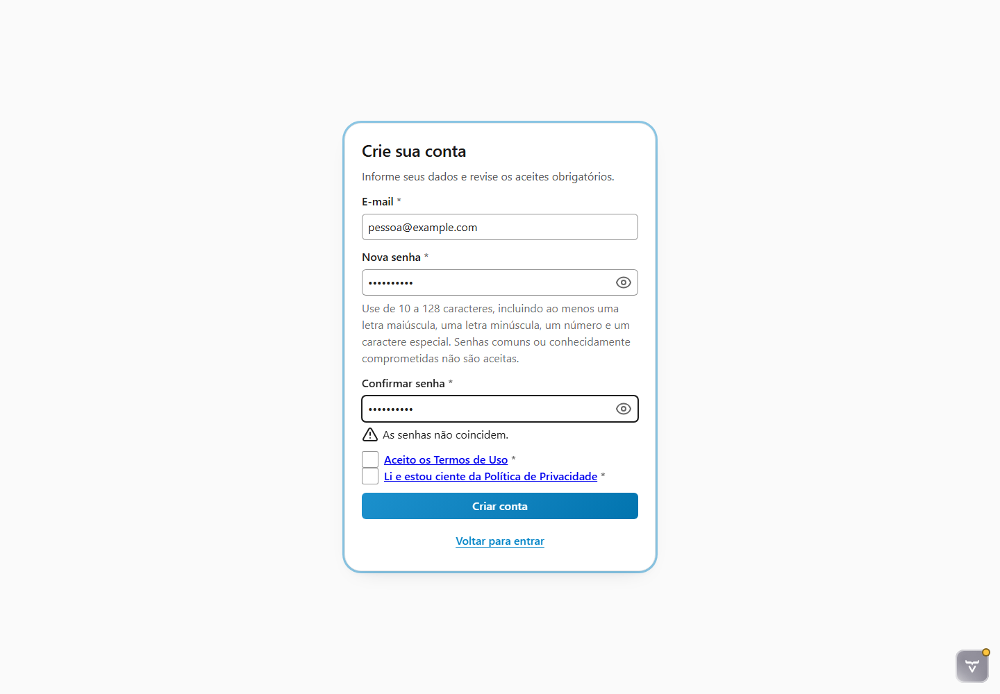
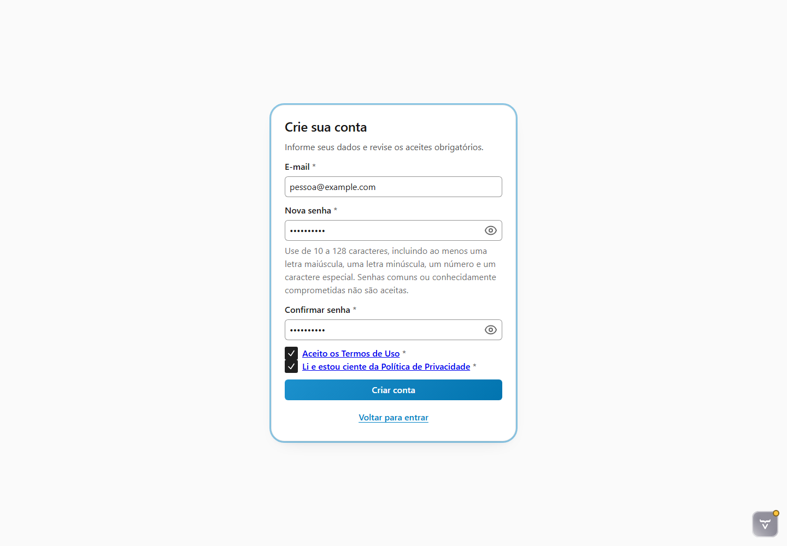
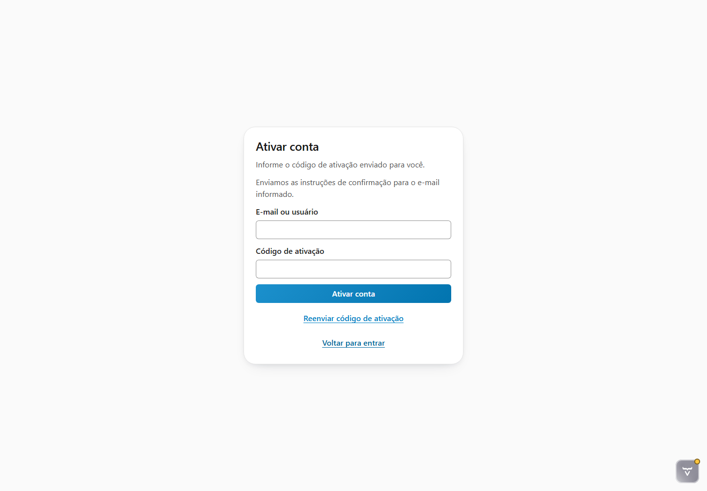
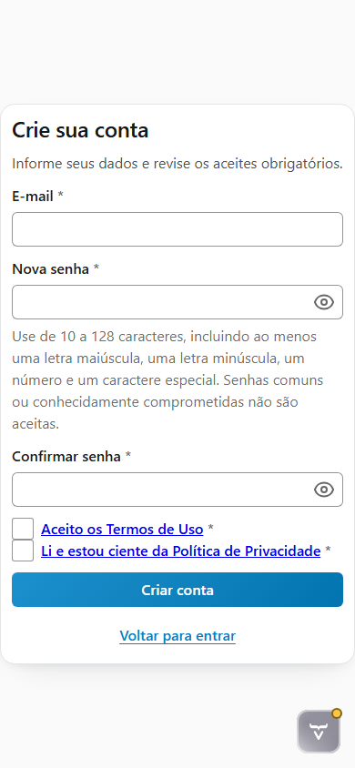

# Evidências da tarefa 6.1.8

Data da validação: 2026-07-30

## Escopo exercitado

- composição real da rota `/login` com `RFWAccessComponent`;
- abertura do cadastro local, instrução de senha e documentos obrigatórios;
- validação de confirmação de senha, estado inválido e foco no primeiro erro;
- submissão nominal e transição para ativação;
- anúncio da confirmação de envio como região acessível de status;
- reflow sem overflow horizontal em desktop e telefone;
- carregamento do stylesheet agregado `context://rfw-platform/styles.css`.

O harness usa providers e documentos determinísticos em memória. Ele não substitui os testes transacionais com MySQL
da fase 7 nem comprova envio SMTP.

## Evidências visuais

### Erro e foco — desktop 1440 × 1000



### Cadastro pronto — desktop 1440 × 1000



### Confirmação de envio — desktop 1440 × 1000



### Reflow — telefone 390 × 844



## Validação automatizada

```text
mvn -q test-compile -Drinos.ui.e2e.enabled=true -Dit.test=RegistrationViewE2EIT \
  failsafe:integration-test failsafe:verify

Tests run: 2, Failures: 0, Errors: 0, Skipped: 0
```

O E2E também verifica presença dos dois documentos obrigatórios, instrução de senha, foco após erro, checkboxes,
transição tipada para `ACTIVATION`, mensagem de confirmação e ausência de overflow horizontal.

O gate completo `mvn verify` também foi aprovado:

```text
Unitários: 244 executados, 0 falhas, 0 erros
Integração: 47 encontrados, 0 falhas, 0 erros, 37 ignorados
BUILD SUCCESS
```

Dos 37 testes ignorados, 35 dependem do MySQL descartável ainda indisponível neste ambiente e dois são os testes de
navegador opt-in. A integração HTTP/Vaadin foi executada com sucesso nesse gate, e os dois testes de navegador foram
executados separadamente pelo comando opt-in acima.

## Inspeção interativa

A inspeção manual controlada confirmou:

- token de destaque do RFW carregado com valor `#0284c7`;
- família tipográfica pública do RFW iniciada por `Inter`;
- `scrollWidth` igual à largura útil, sem overflow horizontal;
- mensagem “Enviamos as instruções de confirmação para o e-mail informado.” exposta com papel `status`;
- nenhuma mensagem de erro no console durante a jornada.

> [!NOTE]
> O ícone “Vaadin Copilot” visível nas capturas pertence exclusivamente ao modo de desenvolvimento do Vaadin e não
> integra a interface de produção.
