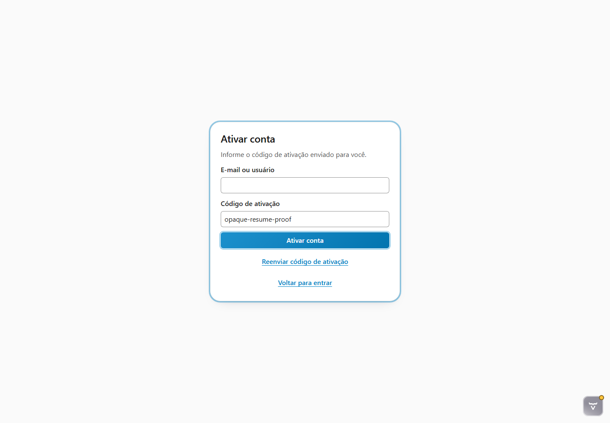
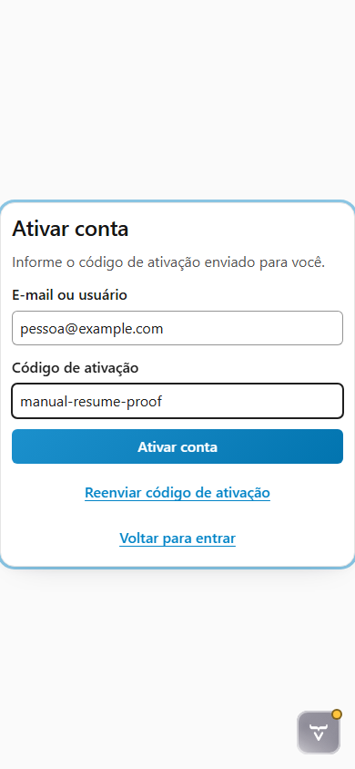
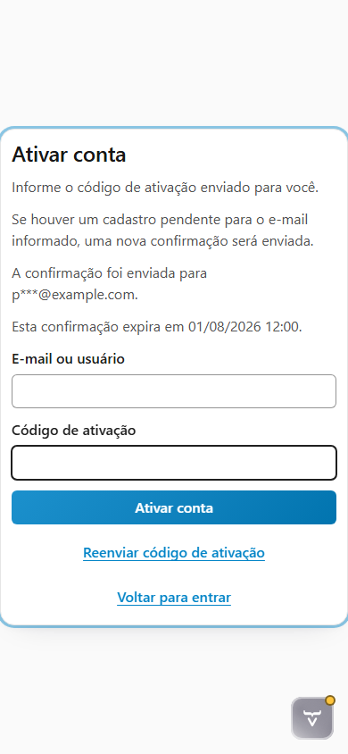

# Evidências da tarefa 6.2.8

Data da validação: 2026-08-01

## Baseline da plataforma

Antes da execução, o submódulo RFW Platform foi comparado com `origin/main`. Durante a revisão final, uma nova
revisão documental foi publicada e o ponteiro avançou por fast-forward para
`e24e9a3ac73cb9f0df06a043ef314b0246012abd`.

O delta atualiza o showroom, as coordenadas e o guia de migração para a RFW 2.0, sem modificar a API ou o runtime
consumido por esta tarefa. O showroom atualizado foi validado isoladamente antes da publicação do ponteiro no Rinos.

```powershell
mvn -q verify  # executado em modules/RFW.Platform/modules/rfw.showroom
```

```text
Tests run: 7, Failures: 0, Errors: 0, Skipped: 0
```

Os testes usam somente `RFWAccessComponentFactory`, `RFWAccessComponent`, os providers e os renderers públicos do
RFW. Não foi criado formulário, CSS ou componente paralelo no Rinos.

## Escopo exercitado

- teste de componente da entrada `ACTIVATION` manual e por deep link;
- campos e ações localizados do renderer padrão;
- prova opaca preenchida somente no estado efêmero do componente;
- `autocomplete="one-time-code"` sem restrição numérica;
- foco inicial na prova manual e na ação **Ativar conta** quando o deep link já fornece a prova;
- remoção da prova da URL visível antes da interação;
- conclusão da ativação sem restaurar a prova no DOM ou na URL;
- reenvio mantendo a etapa `ACTIVATION`, com resposta pública, destino mascarado e expiração localizada;
- reflow sem overflow horizontal em desktop `1440 × 1000` e telefone `390 × 844`;
- stylesheet agregado `context://rfw-platform/styles.css` carregado pelo harness Vaadin.

O harness usa providers determinísticos em memória para exercitar a superfície real. Ele não substitui o
roundtrip UI → facade → MySQL da fase 7 nem comprova envio SMTP.

## Evidências visuais

### Retomada por deep link — desktop 1440 × 1000



### Retomada manual — telefone 390 × 844



### Reenvio e informações seguras — telefone 390 × 844



## Validação automatizada

Teste de componente com o contexto e o renderer público reais:

```powershell
mvn -q "-Dtest=RFWPlatformIntegrationTest" test
```

Resultado:

```text
Tests run: 11, Failures: 0, Errors: 0, Skipped: 0
```

Jornadas reais no Chromium:

```powershell
mvn -q test-compile "-Drinos.ui.e2e.enabled=true" `
  "-Dit.test=RegistrationViewE2EIT" `
  failsafe:integration-test failsafe:verify
```

Resultado:

```text
Tests run: 4, Failures: 0, Errors: 0, Skipped: 0
```

O gate completo do Rinos também foi aprovado:

```powershell
mvn -q verify
```

Resultado com Java 25 e MySQL 9.7.2:

```text
Testes unitários:      292; 0 falhas; 0 erros; 0 ignorados
Testes de integração:  49; 0 falhas; 0 erros; 4 E2E de navegador opt-in
BUILD SUCCESS
```

Os quatro E2E opt-in foram executados separadamente pelo comando anterior. Os cenários MySQL do gate padrão foram
executados, sem skips adicionais.

## Inspeção visual e acessível

A inspeção das capturas e as asserções do navegador confirmaram:

- card, campos, ação principal e ações secundárias legíveis nos dois form factors;
- foco visível e coerente com a origem da retomada;
- largura útil sem overflow horizontal antes e depois do reenvio;
- destino mascarado `p***@example.com`, sem e-mail completo ou ID interno;
- expiração `01/08/2026 12:00` apresentada em `pt-BR` e `America/Sao_Paulo`;
- mensagem, destino e expiração expostos pelas regiões acessíveis do renderer do RFW.

> [!NOTE]
> O ícone do Vaadin Copilot visível nas capturas pertence exclusivamente ao modo de desenvolvimento e não integra a
> interface de produção.

> [!IMPORTANT]
> A matriz claro/escuro, a varredura automatizada WCAG 2.2 AA e as jornadas manuais completas por teclado e leitor de
> tela permanecem no gate transversal 7.3. Esta tarefa valida os riscos específicos da retomada sem antecipar a
> conclusão desse gate de liberação.
