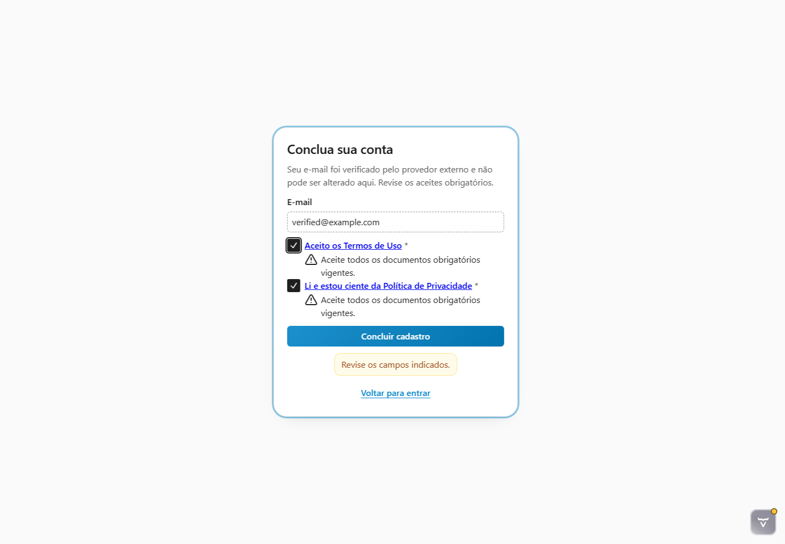
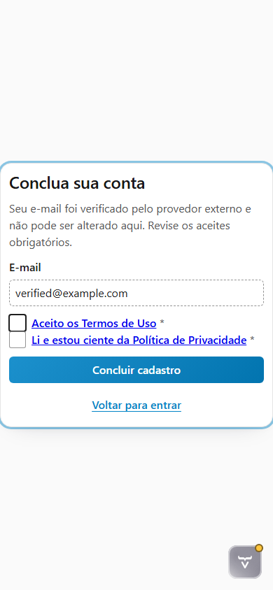

# Evidências da tarefa 6.3.6

Data da validação: 2026-08-01

## Baseline e correções da plataforma

O submódulo foi sincronizado com `origin/main` antes da alteração. A validação identificou duas lacunas genéricas
no renderer `EXTERNAL_REGISTRATION`: não havia foco inicial declarado e a validação local marcava aceites
obrigatórios ausentes sem devolver o foco ao primeiro deles.

As correções foram implementadas no RFW e publicadas antes da atualização do ponteiro do Rinos:

- `36ca38e`: foco inicial no primeiro aceite obrigatório, com fallback para a ação principal;
- `bb6328a`: foco no primeiro aceite obrigatório ausente depois de uma tentativa incompleta.

Cada ciclo atualizou os testes do renderer e as seis versões do guia
`showroom/content/access/registration-lifecycle*.md`. A baseline executável fixada pelo Rinos passou a ser
`bb6328a99a38116d45d4fee417568e8ba911e322`.

Validação isolada da plataforma:

```text
RFW:      300 testes, 0 falhas, 0 erros, 0 ignorados
Showroom:  17 testes, 0 falhas, 0 erros, 0 ignorados
```

## Escopo exercitado no Rinos

O harness Vaadin abre a continuação externa por uma rota existente apenas em `src/test`, com a factory real do
Rinos, o renderer público do RFW, e-mail verificado e a fotografia jurídica determinística. A rota não integra o
artefato de produção e não cria um meio público de fabricar challenges.

As asserções de navegador confirmam:

- foco inicial no checkbox dos Termos de Uso, primeiro documento obrigatório;
- operação dos aceites e da ação principal por teclado;
- e-mail com label acessível, valor verificado e estado somente leitura;
- links e checkboxes legais localizados e descobertos pela árvore de acessibilidade;
- rejeição remota em região `alert`, erros associados aos aceites e retorno de foco ao primeiro inválido;
- apresentação em pt-BR e expansão do texto sem truncamento relevante;
- ausência de overflow horizontal em desktop `1440 × 1000` e telefone `390 × 844`.

O teste estrutural usa roles e nomes acessíveis consumidos por leitores de tela. A avaliação manual completa com
um leitor de tela real permanece no gate transversal 7.3.3 e não é declarada antecipadamente por esta tarefa.

## Evidências visuais

### Feedback e foco — desktop 1440 × 1000



### Reflow localizado — telefone 390 × 844



> [!NOTE]
> O ícone do Vaadin Copilot visível nas capturas pertence exclusivamente ao modo de desenvolvimento e não integra
> a interface de produção.

## Validação automatizada

Integração focal com a factory e os adapters públicos:

```powershell
mvn "-Dtest=RFWPlatformIntegrationTest" test
```

```text
Tests run: 12, Failures: 0, Errors: 0, Skipped: 0
BUILD SUCCESS
```

Seis jornadas reais no Chromium, incluindo os dois novos cenários da continuação Google:

```powershell
mvn "-Drinos.ui.e2e.enabled=true" "-Dtest=RegistrationViewE2EIT" test
```

```text
Tests run: 6, Failures: 0, Errors: 0, Skipped: 0
BUILD SUCCESS
```

Gate completo:

```powershell
mvn verify
```

```text
Testes unitários:      305; 0 falhas; 0 erros; 0 ignorados
Testes de integração:  51; 0 falhas; 0 erros; 6 E2E de navegador opt-in
BUILD SUCCESS
```

Os seis E2E opt-in foram executados separadamente pelo comando anterior. A tarefa 6.3.7 permanece aberta para a
integração Google simulada completa, a consolidação E2E da jornada e a inspeção visual de sua matriz própria.

## Conclusão

A continuação Google oferece ordem de foco determinística, correção por teclado, semântica consumível por
tecnologia assistiva, feedback anunciado e reflow localizado nos dois form factors. A tarefa 6.3.6 está concluída
sem duplicar componente ou CSS do RFW no Rinos.
