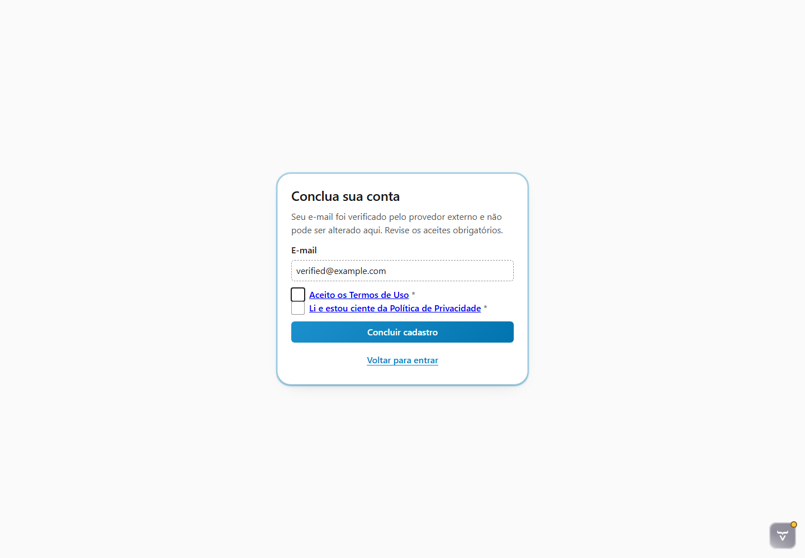
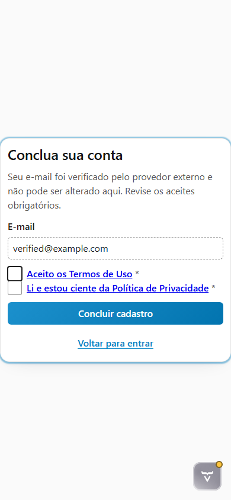

# Evidências da tarefa 6.3.7

Data da validação: 2026-08-01

## Baseline da plataforma

O submódulo RFW Platform foi atualizado por fast-forward até `origin/main`, na revisão
`197df2c1d31a3fa3ff404ac6cfd2bec168723b20`. Essa revisão é descendente da baseline 2.0 aprovada para a feature e
acrescenta o `RFWPicker`, sem alterar os contratos de cadastro consumidos neste gate. Não houve modificação local no
código ou na documentação do RFW.

## Fronteiras exercitadas

O harness substitui somente as fronteiras que não podem depender de serviços externos em um teste determinístico:

- o SDK JavaScript do Google entrega uma credencial fixa pelo callback público do componente;
- o provider simulado valida essa credencial e produz uma identidade Google mínima e verificada;
- as facades de persistência retornam uma continuação opaca e um usuário autenticado determinísticos;
- não há conexão com conta Google real, discovery OIDC, JWKS, rede externa ou MySQL no E2E.

Permanecem reais o `RFWAccessComponent`, sua máquina de estados, os adapters do Rinos, o resolvedor externo, a cadeia
Spring Security, a publicação da sessão autenticada e a navegação protegida até `/user`. A conclusão exige a referência
opaca esperada e os dois documentos jurídicos aceitos; credencial e subject externos não aparecem no DOM.

O teste de componente
`RFWPlatformIntegrationTest.externalRegistration_shouldRenderMinimizedLegalContinuation_whenGoogleRequiresConsent`
continua cobrindo a conversão dos contratos do Rinos para a continuação minimizada do RFW. Os dois novos E2E percorrem
o caminho completo desde `/login`, em desktop e telefone.

## Correção encontrada pela inspeção

A primeira captura revelou que a rota anônima entregava o HTML, mas o Spring Security redirecionava
`/rfw/styles.css` para o próprio login. A cadeia da hospedeira passou a liberar somente os recursos estáticos públicos
`/rfw/**` e `/images/**`. O E2E agora exige que `--rfw-theme-text-color` tenha valor computado no navegador; assim uma
folha ausente, bloqueada ou substituída por HTML falha o gate antes da captura.

## Evidências visuais

### Continuação Google — desktop 1440 × 1000



### Continuação Google — telefone 390 × 844



A inspeção visual confirmou card centralizado, hierarquia legível, e-mail somente leitura, aceites acessíveis, ação
primária destacada e reflow sem overflow horizontal. O ícone do Vaadin Copilot pertence apenas ao modo de
desenvolvimento e não integra a interface de produção.

## Validação automatizada

Jornadas reais no Chromium, incluindo os dois cenários Google:

```powershell
mvn "-Drinos.ui.e2e.enabled=true" "-Dit.test=RegistrationViewE2EIT" verify
```

```text
Testes unitários: 299; 0 falhas; 0 erros; 0 ignorados
E2E Chromium:       8; 0 falhas; 0 erros; 0 ignorados
BUILD SUCCESS
```

Gate padrão com Java 25 e MySQL 9.7.2:

```powershell
mvn verify
```

```text
Testes unitários:      305; 0 falhas; 0 erros; 0 ignorados
Testes de integração:   53; 0 falhas; 0 erros; 8 E2E opt-in ignorados
BUILD SUCCESS
```

Os oito E2E ignorados no gate padrão foram executados com sucesso pelo comando explícito anterior. A inspeção manual
no navegador também confirmou a presença do título, e-mail verificado, dois aceites e ação de conclusão na rota de
continuação.

> [!IMPORTANT]
> O teste simulado prova a integração interna e a sessão completa, mas não substitui a validação operacional das
> credenciais e origens autorizadas no Google Cloud antes da publicação em produção.
