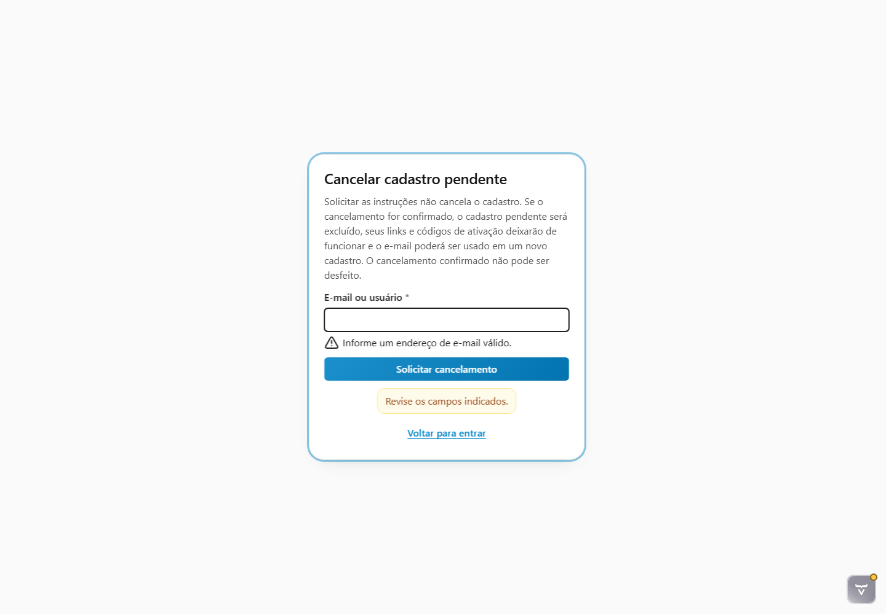
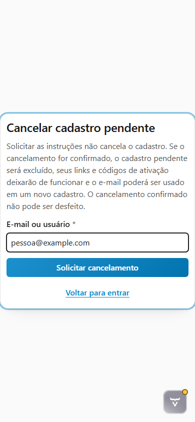

# Evidências da tarefa 6.4.6

Data da validação: 2026-08-02

## Correção reutilizável na RFW

A inspeção encontrou uma lacuna no renderer compartilhado: `REGISTRATION_CANCELLATION_REQUEST` não declarava foco
inicial. A RFW passou a direcioná-lo ao identificador, preservando a precedência de campos inválidos. A mudança foi
testada, explicada nas seis versões do guia `registration-lifecycle` do showroom e commitada no submódulo em
`1ca70228580eeff97e0a897cb35aed9e60834291`.

Validação isolada:

```text
RFW Platform: 313 testes; 0 falhas; 0 erros; 0 ignorados
RFW Showroom:  21 testes; 0 falhas; 0 erros; 0 ignorados
```

## Contratos exercitados no navegador

As jornadas Chromium usam a rota `/login`, a factory real do Rinos, o renderer público do RFW e um provider
determinístico restrito a `src/test`. Elas comprovam:

- título, consequência, label persistente, obrigatoriedade e ações em pt-BR;
- foco inicial no identificador e sequência por teclado até a ação principal;
- submissão por `Enter`, erro associado ao campo, região `alert` e retorno do foco ao identificador inválido;
- transição por teclado para a confirmação quando a solicitação é válida;
- viewport de telefone `390 × 844` sem overflow horizontal;
- alvo da ação principal com ao menos `24 × 24` pixels CSS e acionamento pela API de toque do navegador;
- a mesma consequência e as mesmas ações sem depender de hover ou de cor.

A ordem estrutural incluindo o Turnstile, sua ação contextual e o token de uso único permanece coberta pela
[evidência 6.4.3](../6.4.3/README.md). O widget externo não foi falsificado neste E2E de apresentação.

O teste usa roles, nomes acessíveis, estados `required` e `invalid` e regiões vivas consumidas por tecnologias
assistivas. A avaliação humana com leitor de tela real continua pertencendo ao gate transversal 7.3.3.

## Evidências visuais

### Erro anunciado e foco — desktop 1440 × 1000



### Reflow e alvo de toque — telefone 390 × 844



> [!NOTE]
> O ícone do Vaadin Copilot nas capturas pertence exclusivamente ao modo de desenvolvimento.

## Validação automatizada

Jornadas reais no Chromium:

```powershell
mvn test-compile '-Drinos.ui.e2e.enabled=true' '-Dit.test=RegistrationViewE2EIT' `
  failsafe:integration-test failsafe:verify
```

```text
10 testes; 0 falhas; 0 erros; 0 ignorados
BUILD SUCCESS
```

Gate completo do Rinos:

```powershell
mvn verify
```

```text
Testes unitários: 316; 0 falhas; 0 erros; 0 ignorados
Testes de integração: 56; 0 falhas; 0 erros; 10 E2E opt-in ignorados
BUILD SUCCESS
```

Os dez E2E ignorados no gate padrão foram executados com sucesso pelo comando explícito anterior.
