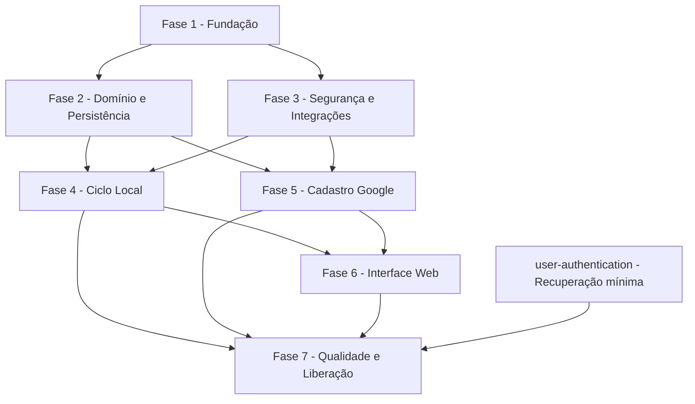

# Tarefas Rinos - Cadastro e Ciclo Inicial do Usuário

Escopo: implementar a identidade global e o ciclo público de cadastro local ou Google até ativação, cancelamento ou expiração, usando RFW Platform, schema global MySQL e interface Vaadin responsiva.

**Origem**: [spec.md](./spec.md), [plan.md](./plan.md), [interface-spec.md](./interface-spec.md) e [requirements checklist](./checklists/requirements.md)

**Legenda de status:**

- `[ ]` Pendente
- `[~]` Em andamento
- `[x]` Concluído
- `[!]` Bloqueado

**Legenda de criticidade:**

- `[C]` Crítico - Impacto regulatório, segurança, integridade, SLA ou operação bloqueante
- `[A]` Alto - Funcionalidade essencial para o ciclo de cadastro
- `[M]` Médio - Necessário, mas adiável sem impedir o fluxo principal

> [!IMPORTANT]
> `tasks.md` é a fonte de verdade da execução. O executor deve verificar evidências existentes antes de iniciar, marcar cada subtarefa concluída no mesmo ciclo e acrescentar trabalho emergente rastreável quando necessário.

---

## FASE 1 - Fundação da Aplicação

### 1.1 Estruturar a aplicação Spring Boot hospedeira `[A]`

Ref: [Plan §Project Structure](./plan.md), `AGENTS-JAVA-SPRING-BOOT.md`

- [x] 1.1.1 Criar o `pom.xml` raiz com Java 25, Spring Boot, Vaadin, JPA, Validation, Mail, MySQL e dependência do RFW Platform
- [x] 1.1.2 Criar a classe principal em `br.com.rinos.app`
- [x] 1.1.3 Criar os packages-base `config`, `shared`, `api`, `backend` e `ui` sem dependências invertidas
- [x] 1.1.4 Configurar build, compilação, testes unitários e testes de integração com convenções `*Test` e `*IT`
- [x] 1.1.5 Documentar comandos locais de build e execução sem registrar valores reais de ambiente
- [x] 1.1.6 Validar o build vazio e a inicialização controlada da aplicação

### 1.2 Implementar configuração explícita e exclusiva `[C]`

Ref: [Plan §Configuration Ownership](./plan.md), [Constitution §Restrições de Arquitetura e Segurança](../../constitution.md)

- [x] 1.2.1 Ignorar `application.properties` e criar `application.properties.model` versionado na raiz
- [x] 1.2.2 Declarar grupos tipados para cadastro, comprovação, origem, proxy, Turnstile, Google, HIBP, SMTP e limpeza
- [x] 1.2.3 Impedir precedência de argumentos de linha de comando, propriedades JVM e variáveis de ambiente não declaradas no arquivo
- [x] 1.2.4 Validar propriedades obrigatórias e valores incompatíveis durante a inicialização
- [x] 1.2.5 Configurar `PhysicalNamingStrategyStandardImpl` e UTC como referência persistente
- [x] 1.2.6 Espelhar atributos e comentários entre o modelo e o arquivo local de desenvolvimento
- [x] 1.2.7 Criar testes de binding, defaults, origem exclusiva e falha de inicialização

### 1.3 Integrar a RFW Platform como fundação pública `[A]`

Ref: [RFW Usage](../../architecture/rfw-platform-usage.md), [Plan §RFW Compatibility Gate](./plan.md)

- [x] 1.3.1 Fixar a dependência na revisão do submódulo aprovada para a feature
- [x] 1.3.2 Configurar i18n, tema e factories públicas do RFW sem copiar componentes
- [x] 1.3.3 Configurar a hospedeira para consumir a `RFWAccessComponentFactory` auto-configurada, sem duplicá-la
- [x] 1.3.4 Registrar providers RFW somente quando houver adapters apoiados nos contratos da camada `api`
- [x] 1.3.5 Criar teste de contexto que confirme capabilities presentes e ausentes
- [x] 1.3.6 Documentar pontos de extensão locais e o procedimento para futuras evoluções genéricas no RFW

### 1.4 Preparar atualização automática do schema global `[C]`

Ref: [Plan §Transaction and Failure Strategy](./plan.md), [Data Model](./data-model.md),
[Organização dos scripts de banco](../../architecture/database-scripts.md), `AGENTS-DATABASE.md`

- [x] 1.4.1 Criar diretórios `src/main/resources/db/global/init` e `src/main/resources/db/global/update`, reservando
  `src/main/resources/db/tenant/init` e `src/main/resources/db/tenant/update` como catálogos independentes
- [x] 1.4.2 Criar no catálogo global o esqueleto `01-ddl.sql`, `02-seed.sql`, `03-procedures.sql` e
  `99-database-version.sql`
- [x] 1.4.3 Integrar o updater do RFW ao bootstrap do schema global usando exclusivamente
  `classpath:db/global/update`
- [x] 1.4.4 Bloquear a aplicação com diagnóstico seguro quando init ou update falhar
- [x] 1.4.5 Criar teste de banco global vazio, banco atualizado, versão incompatível e isolamento em relação aos
  catálogos de tenant
- [x] 1.4.6 Documentar indisponibilidade durante migrations, intervenção externa em caso de falha e a separação entre
  inicialização global, inicialização de tenant e seus respectivos updates

### 1.5 Implementar coordenação automática de manutenção `[C]`

Ref: [Platform Operations §Coordenação de Manutenção](../platform-operations/spec.md), [Research §Decision 10](./research.md)

- [x] 1.5.1 Declarar `instanceId`, intervalo de heartbeat, prazo de expiração, estabilização e timeout transacional de lote como properties tipadas, com padrões de 30 minutos, quatro horas, 10 minutos e cinco minutos; rejeitar timeout igual ou superior à estabilização
- [x] 1.5.2 Criar migration, entity e repository globais para `platform_maintenanceLease` com `leaseKey` único, sessão, `epoch`, instantes e versionamento
- [x] 1.5.3 Gerar `sessionId` novo por inicialização e usar exclusivamente o relógio do MySQL para aquisição, heartbeat e expiração
- [ ] 1.5.4 Implementar aquisição e tomada atômicas com um vencedor, incremento de `epoch` e renovação condicionada ao proprietário vigente
- [ ] 1.5.5 Impedir execução antes da estabilização de 10 minutos, exigir nova comprovação do lease antes de cada job e lote e executar cada lote em transação sujeita ao timeout configurado
- [ ] 1.5.6 Suspender novos lotes diante de perda, fencing divergente, falha de heartbeat ou indisponibilidade do banco global
- [ ] 1.5.7 Instrumentar aquisição, renovação, perda, tomada e rejeição sem criar versões em `platform-configuration`
- [ ] 1.5.8 Criar testes com duas instâncias, mesmo `instanceId`, reinício, expiração, retorno da líder antiga, lote antigo bloqueado, timeout, ausência de sobreposição, relógio local divergente e banco indisponível

---

## FASE 2 - Domínio Global e Persistência

### 2.1 Modelar usuário global e cadastro pendente `[C]`

Ref: [Spec §FR-USR-001–010](./spec.md), [Data Model §User e §Registration](./data-model.md)

- [ ] 2.1.1 Criar enums de estado, origem e transição no backend
- [ ] 2.1.2 Criar `UserEntity` com e-mail normalizado, estado, versionamento e timestamps
- [ ] 2.1.3 Criar `RegistrationEntity` 1:1 com origem, expiração e estado do processo
- [ ] 2.1.4 Mapear transições permitidas sem colocar regra de negócio nas entities
- [ ] 2.1.5 Criar repositories restritos ao backend com consultas por e-mail normalizado e estado
- [ ] 2.1.6 Implementar services de identidade, normalização e lifecycle
- [ ] 2.1.7 Criar testes unitários de estados e integração de unicidade e optimistic locking

### 2.2 Modelar credenciais e comprovações `[C]`

Ref: [Spec §FR-USR-012 e FR-REG-012–019](./spec.md), [Data Model §LocalCredential e §Verification](./data-model.md)

- [ ] 2.2.1 Criar `LocalCredentialEntity` sem exposição fora do backend
- [ ] 2.2.2 Criar `VerificationEntity` para e-mail e cancelamento com hash, propósito, estado e validade
- [ ] 2.2.3 Criar repositories para credencial vigente e comprovação aberta bloqueável
- [ ] 2.2.4 Implementar geração criptográfica, hashing e comparação constante de provas
- [ ] 2.2.5 Implementar invalidação de provas anteriores por propósito
- [ ] 2.2.6 Garantir remoção da credencial local ao reutilizar pendência pelo Google
- [ ] 2.2.7 Criar testes de uso único, expiração, prova cruzada, replay e ausência de segredo em retornos

### 2.3 Modelar documentos legais e consentimentos `[C]`

Ref: [Spec §FR-USR-010–011 e FR-REG-005–006](./spec.md), [Data Model §LegalDocumentVersion e §LegalConsent](./data-model.md)

- [ ] 2.3.1 Criar `LegalDocumentVersionEntity` com versão, vigência, obrigatoriedade e finalidade
- [ ] 2.3.2 Criar `LegalConsentEntity` associado ao usuário e à versão aceita
- [ ] 2.3.3 Criar repositories para versões vigentes e consentimentos existentes
- [ ] 2.3.4 Implementar service que valide conjunto obrigatório e preserve decisões opcionais separadas
- [ ] 2.3.5 Implementar detecção de versão alterada durante cadastro pendente
- [ ] 2.3.6 Criar testes de vigência, duplicidade, alteração legal e minimização na expiração

### 2.4 Modelar identidade externa, origem e auditoria `[C]`

Ref: [Spec §FR-USR-007 e FR-REG-029, FR-REG-037–049](./spec.md), [Data Model §ExternalIdentity, §OriginWindow e §IdentityEvent](./data-model.md)

- [ ] 2.4.1 Criar `ExternalIdentityEntity` com unicidade por `issuer + subject`
- [ ] 2.4.2 Criar `OriginWindowEntity` global com IP normalizado em `VARBINARY(16)`, operação, política, janela, contador e bloqueio
- [ ] 2.4.3 Criar `IdentityEventEntity` sem PII ou segredos
- [ ] 2.4.4 Criar repositories com consultas por vínculo externo, janela e eventos
- [ ] 2.4.5 Implementar service de auditoria de transições e resultados públicos
- [ ] 2.4.6 Implementar tombstone de cancelamento sem identificador direto
- [ ] 2.4.7 Criar testes de unicidade externa, normalização IPv4/IPv6, retenção de origem e sanitização de eventos

### 2.5 Criar schema, constraints e validação de paridade `[C]`

Ref: [Data Model §Cross-Entity Invariants e §Referential Actions](./data-model.md), `AGENTS-DATABASE.md`

- [ ] 2.5.1 Materializar tabelas globais no `01-ddl.sql` com nomes, tipos e nulidade documentados
- [ ] 2.5.2 Criar PKs, FKs, UKs e índices para e-mail, token, `issuer + subject`, estados e janelas
- [ ] 2.5.3 Definir `ON DELETE` e `ON UPDATE` explicitamente conforme retenção e integridade
- [ ] 2.5.4 Atualizar `99-database-version.sql` com a versão inicial efetiva
- [ ] 2.5.5 Criar teste de paridade entre mappings JPA e schema MySQL 9
- [ ] 2.5.6 Criar testes concorrentes para e-mail e identidade externa únicos
- [ ] 2.5.7 Validar init completo, rollback de falha e ausência de objetos tenant neste domínio

---

## FASE 3 - Segurança e Integrações Externas

### 3.1 Implementar normalização e política de senha com HIBP `[C]`

Ref: [Spec §FR-REG-003–004](./spec.md), [Contracts §Pwned Passwords](./contracts/external-services.md)

- [ ] 3.1.1 Implementar normalizador canônico de e-mail e validação estrutural
- [ ] 3.1.2 Implementar política de 10–128 caracteres e classes obrigatórias com erros públicos por regra
- [ ] 3.1.3 Implementar consulta HIBP por prefixo SHA-1 com `Add-Padding`
- [ ] 3.1.4 Implementar timeout, payload defensivo e política fail-closed
- [ ] 3.1.5 Configurar Argon2id por `PasswordEncoder` com properties tipadas e piso de 19.456 KiB, duas iterações, paralelismo um, salt de 16 bytes e hash de 32 bytes
- [ ] 3.1.6 Garantir limpeza de senha, hashes intermediários e resposta HIBP de logs e auditoria
- [ ] 3.1.7 Criar testes unitários e de integração local para senhas válidas, comuns, comprometidas e indisponibilidade
- [ ] 3.1.8 Criar ferramenta reproduzível de calibração com aquecimento, no mínimo 50 medições e relatório de mediana e percentil 95 sem expor senha ou hash
- [ ] 3.1.9 Validar identificador, parâmetros codificados, verificação de hashes anteriores e rejeição de configuração abaixo do piso

### 3.2 Implementar origem confiável e limites por IP `[C]`

Ref: [Spec §FR-REG-037–041](./spec.md), [Research §Decision 6](./research.md)

- [ ] 3.2.1 Implementar resolução do endereço remoto com allowlist explícita de proxies
- [ ] 3.2.2 Rejeitar cadeias encaminhadas inconsistentes ou originadas fora de proxy confiável
- [ ] 3.2.3 Implementar normalização canônica de IPv4/IPv6 e persistência binária da origem sem HMAC ou criptografia
- [ ] 3.2.4 Implementar janela persistida e contador atômico para limiar Turnstile e limite máximo absoluto, com padrões de 20 novas pendências em 24 horas
- [ ] 3.2.5 Retornar bloqueio temporário com instante de liberação sem exceção por Turnstile válido
- [ ] 3.2.6 Integrar ao catálogo diário coordenado uma limpeza idempotente, em lotes próprios, que exclua a origem até 30 dias depois do fim da janela sob o lease e timeout transacional vigentes
- [ ] 3.2.7 Garantir que somente a criação efetiva de nova pendência incremente o limite, excluindo rejeições, retomadas, reenvios, cancelamentos e convergências idempotentes
- [ ] 3.2.8 Criar testes de NAT compartilhado, proxy forjado, concorrência, vigésima primeira criação, término automático do bloqueio, retenção máxima, troca de liderança e repetição segura da limpeza

### 3.3 Integrar Cloudflare Turnstile pelo RFW `[C]`

Ref: [Spec §FR-REG-028 e FR-REG-034–042](./spec.md), [Contracts §Cloudflare Turnstile](./contracts/external-services.md)

- [ ] 3.3.1 Implementar `RFWHumanVerificationRequirementProvider` por operação e origem
- [ ] 3.3.2 Configurar `RFWTurnstileVerificationService` com site key, secret, hostname, action e timeout
- [ ] 3.3.3 Gerar `idempotency_key` por tentativa de Siteverify
- [ ] 3.3.4 Mapear token inválido, divergência, indisponibilidade e configuração inválida para resultados públicos
- [ ] 3.3.5 Garantir validação antes de qualquer persistência do cadastro
- [ ] 3.3.6 Criar testes com servidor local simulado para sucesso, replay, timeout, hostname e action divergentes

### 3.4 Implementar despacho SMTP pós-commit pelo RFW `[A]`

Ref: [Spec §FR-REG-012, FR-REG-014 e FR-REG-032](./spec.md), [Contracts §SMTP por RFW](./contracts/external-services.md)

- [ ] 3.4.1 Montar a mensagem de comprovação em memória pelo serviço de template do RFW, com locale e correlation ID
- [ ] 3.4.2 Executar o dispatch somente depois do commit, com timeouts explícitos de conexão e transporte
- [ ] 3.4.3 Confirmar envio à UI somente depois da aceitação pelo SMTP
- [ ] 3.4.4 Preservar a pendência e retornar orientação de retomada e reenvio em falha de template, timeout ou transporte
- [ ] 3.4.5 Impedir destinatário completo, token, URL secreta e mensagem renderizada em persistência, logs ou eventos operacionais
- [ ] 3.4.6 Medir tempo do commit até aceitação SMTP e tentativas por resultado
- [ ] 3.4.7 Criar testes de commit, aceitação, timeout, falha de template/transporte e recuperação por reenvio sem retentativa automática

### 3.5 Configurar e validar Google OpenID Connect `[C]`

Ref: [Spec §FR-REG-043–052](./spec.md), [Contracts §Google OpenID Connect](./contracts/external-services.md)

- [ ] 3.5.1 Configurar `RFWGoogleSignInComponent` e `RFWGoogleIdentityProvider`
- [ ] 3.5.2 Validar issuer, assinatura, audience, expiração, emissão, nonce e e-mail verificado
- [ ] 3.5.3 Implementar `RFWExternalIdentityResolver` com VO sem token bruto
- [ ] 3.5.4 Mapear identidade inválida, conflito, usuário ativo e indisponibilidade para resultados públicos
- [ ] 3.5.5 Impedir escopos Google além de identidade e e-mail
- [ ] 3.5.6 Garantir efemeridade de ID token, nonce e claims não necessários
- [ ] 3.5.7 Criar testes com emissor local simulado para sucesso, replay, claim ausente, conflito e timeout

---

## FASE 4 - Ciclo Local do Cadastro

### 4.1 Publicar contratos e providers do ciclo local `[A]`

Ref: [Plan §Architecture and Responsibility Boundaries](./plan.md), [RFW Compatibility](./rfw-gap-analysis.md)

- [ ] 4.1.1 Criar DTOs estruturais e VOs públicos sem entities ou segredos
- [ ] 4.1.2 Criar facade pública para início, ativação, reenvio, cancelamento e consulta segura de estado
- [ ] 4.1.3 Implementar facade transacional no backend
- [ ] 4.1.4 Implementar `RFWRegistrationProvider`
- [ ] 4.1.5 Implementar `RFWActivationConsentProvider`
- [ ] 4.1.6 Implementar `RFWRegistrationCancellationProvider`
- [ ] 4.1.7 Criar testes de paridade entre contratos Rinos, outcomes RFW e erros por campo

### 4.2 Implementar início do cadastro local `[C]`

Ref: [Spec §FR-REG-001–011](./spec.md), [Quickstart §Scenarios 1–5](./quickstart.md)

- [ ] 4.2.1 Validar Turnstile, origem, limite, e-mail, senha e aceites antes da escrita
- [ ] 4.2.2 Criar ou convergir para usuário e cadastro pendentes pelo e-mail normalizado
- [ ] 4.2.3 Tratar usuário ativo com mensagem explícita e resultado de recuperação sem revelar outros dados
- [ ] 4.2.4 Persistir credencial, consentimentos e comprovação em uma transação, mantendo o token somente em memória até o dispatch pós-commit
- [ ] 4.2.5 Resolver constraint concorrente relendo o estado vencedor sem duplicar efeitos
- [ ] 4.2.6 Impedir identidade ativa ou credencial utilizável em falha parcial
- [ ] 4.2.7 Registrar evento sanitizado de início aceito ou rejeitado
- [ ] 4.2.8 Criar testes unitários, integração MySQL e concorrência para todos os resultados

### 4.3 Implementar comprovação, reenvio e ativação `[C]`

Ref: [Spec §FR-REG-012–024](./spec.md), [Interface §INT-WEB-REG-002](./interface-spec.md)

- [ ] 4.3.1 Consumir prova válida com lock e releitura do cadastro
- [ ] 4.3.2 Rejeitar prova ausente, cruzada, expirada, usada, invalidada ou de processo encerrado
- [ ] 4.3.3 Implementar limite de três reenvios em 15 minutos com tempo restante
- [ ] 4.3.4 Invalidar provas abertas antes de emitir e despachar a nova
- [ ] 4.3.5 Detectar documentos obrigatórios alterados e emitir continuação opaca de aceite
- [ ] 4.3.6 Revalidar referência, expiração, uso único e documentos na conclusão do aceite
- [ ] 4.3.7 Ativar exatamente um usuário e invalidar todas as provas na mesma transação
- [ ] 4.3.8 Tornar ativação e continuação idempotentes para repetições
- [ ] 4.3.9 Criar testes de reenvio, replay, mudança legal, race de ativação e acesso inicial

### 4.4 Implementar cancelamento de cadastro pendente `[C]`

Ref: [Spec §FR-REG-025–027](./spec.md), [Interface §INT-WEB-REG-004 e INT-WEB-REG-005](./interface-spec.md)

- [ ] 4.4.1 Solicitar cancelamento com resposta neutra e política Turnstile própria
- [ ] 4.4.2 Emitir prova `REGISTRATION_CANCEL` sem cancelar antes da confirmação
- [ ] 4.4.3 Confirmar controle do e-mail com prova válida e uso único
- [ ] 4.4.4 Invalidar provas, remover credencial e liberar o e-mail atomicamente
- [ ] 4.4.5 Criar tombstone sem PII e registrar evento sanitizado
- [ ] 4.4.6 Tornar repetição segura sem restaurar ou repetir efeitos
- [ ] 4.4.7 Criar testes de solicitação neutra, prova inválida, cancelamento concorrente e novo cadastro

### 4.5 Implementar expiração e coordenar limpezas diárias `[C]`

Ref: [Spec §FR-REG-023–024 e FR-REG-039](./spec.md), [Data Model §Retention and Cleanup](./data-model.md)

- [ ] 4.5.1 Implementar seleção paginada de pendências vencidas com lock seguro
- [ ] 4.5.2 Excluir usuário pendente, registro, credencial, consentimentos e provas na ordem íntegra
- [ ] 4.5.3 Preservar somente tombstone permitido quando aplicável
- [ ] 4.5.4 Impedir exclusão de usuário ativado durante corrida com o job
- [ ] 4.5.5 Agendar ao menos diariamente o catálogo que inclui expiração de cadastros e retenção de janelas de origem, exigindo liderança vigente, `epoch` atual, estabilização e timeout transacional antes de cada lote próprio
- [ ] 4.5.6 Criar testes com relógio controlado, lotes, repetição, troca de liderança, timeout, ausência de sobreposição, ativação concorrente, retenção de origem e falha parcial

### 4.6 Instrumentar auditoria e métricas do backend `[M]`

Ref: [Spec §FR-USR-007 e FR-REG-029–030](./spec.md), [Interface §Telemetry](./interface-spec.md)

- [ ] 4.6.1 Definir nomes estáveis para eventos e métricas do ciclo local
- [ ] 4.6.2 Registrar duração, resultado público, operação e correlation ID
- [ ] 4.6.3 Medir pendências, ativações, cancelamentos, expirações, bloqueios e dispatch SMTP
- [ ] 4.6.4 Sanitizar mensagens e parâmetros antes de log e auditoria
- [ ] 4.6.5 Criar testes de ausência de e-mail, IP bruto, senha, token, prova e URL secreta
- [ ] 4.6.6 Documentar métricas, alertas recomendados e limites de responsabilidade operacional

---

## FASE 5 - Cadastro por Google

### 5.1 Resolver identidade Google contra o domínio `[C]`

Ref: [Spec §FR-REG-043–049](./spec.md), [Quickstart §Scenarios 10–12](./quickstart.md)

- [ ] 5.1.1 Localizar vínculo existente por `issuer + subject`
- [ ] 5.1.2 Rejeitar vínculo externo associado a outro usuário sem expor sua identidade
- [ ] 5.1.3 Localizar usuário ativo pelo e-mail sem criar vínculo automático
- [ ] 5.1.4 Localizar e bloquear cadastro pendente pelo e-mail normalizado
- [ ] 5.1.5 Iniciar nova pendência Google quando não existir identidade correspondente
- [ ] 5.1.6 Emitir continuação opaca com e-mail verificado somente leitura
- [ ] 5.1.7 Registrar resultado sanitizado sem ID token ou claims desnecessários
- [ ] 5.1.8 Criar testes de todas as ramificações e constraints concorrentes

### 5.2 Concluir cadastro externo e ativação `[C]`

Ref: [Spec §FR-REG-045–047 e FR-REG-050](./spec.md), [Interface §INT-WEB-REG-003](./interface-spec.md)

- [ ] 5.2.1 Implementar `RFWExternalRegistrationProvider`
- [ ] 5.2.2 Revalidar referência, expiração, uso único e identidade externa
- [ ] 5.2.3 Validar documentos legais vigentes e aceites opcionais separados
- [ ] 5.2.4 Invalidar e remover credencial local e provas da pendência reutilizada
- [ ] 5.2.5 Persistir vínculo externo único e consentimentos antes da ativação
- [ ] 5.2.6 Ativar usuário sem senha local ou confirmação adicional por e-mail
- [ ] 5.2.7 Publicar autenticação somente após commit completo
- [ ] 5.2.8 Criar testes transacionais, idempotência, mudança legal e race com ativação local

### 5.3 Cobrir falhas, replay e indisponibilidade Google `[C]`

Ref: [Spec §FR-REG-048–052](./spec.md), [Contracts §Google Failure mapping](./contracts/external-services.md)

- [ ] 5.3.1 Rejeitar token inválido, expirado, reapresentado ou sem e-mail verificado
- [ ] 5.3.2 Rejeitar referência externa expirada, usada ou conflitante sem escrita parcial
- [ ] 5.3.3 Oferecer cadastro local quando o Google estiver indisponível
- [ ] 5.3.4 Encaminhar usuário ativo sem vínculo para futura reautenticação
- [ ] 5.3.5 Garantir que falhas não removam credencial pendente antes da transação de conclusão
- [ ] 5.3.6 Criar testes de integração para falhas antes, durante e depois da resolução

---

## FASE 6 - Interface Web RFW

### 6.1 Implementar INT-WEB-REG-001 - Cadastro local `[A]`

Ref: [Interface §INT-WEB-REG-001](./interface-spec.md), [Spec §FR-REG-001–011 e FR-REG-028–042](./spec.md)

- [ ] 6.1.1 Compor `REGISTRATION` na rota pública usando `RFWAccessComponentFactory`
- [ ] 6.1.2 Configurar documentos legais, Turnstile condicional, idioma, tema e slots autorizados
- [ ] 6.1.3 Integrar dados reais pelo provider sem acesso da UI ao backend
- [ ] 6.1.4 Mapear estados inicial, ready, processing, success, erros, offline e conteúdo obsoleto
- [ ] 6.1.5 Preservar somente e-mail e aceites; limpar senha, confirmação e token em toda submissão
- [ ] 6.1.6 Disponibilizar recuperação preenchida quando a capability obrigatória de release estiver presente
- [ ] 6.1.7 Cobrir teclado, leitor de tela, touch, telefone, desktop e localização
- [ ] 6.1.8 Criar testes de componente, integração Vaadin, E2E e inspeção visual registrada

### 6.2 Implementar INT-WEB-REG-002 - Ativação e retomada `[A]`

Ref: [Interface §INT-WEB-REG-002](./interface-spec.md), [Spec §FR-REG-012–024](./spec.md)

- [ ] 6.2.1 Compor `ACTIVATION` para código manual e deep link opaco
- [ ] 6.2.2 Integrar ativação, reenvio, limite, cancelamento e retorno seguro ao login
- [ ] 6.2.3 Compor `ACTIVATION_CONSENT` para novas versões legais
- [ ] 6.2.4 Exibir somente e-mail seguro e documentos exigidos pela continuação
- [ ] 6.2.5 Cobrir provas inválidas, expiradas, usadas, cadastro encerrado e falha SMTP
- [ ] 6.2.6 Cobrir foco, `one-time-code`, anúncios, responsividade e localização temporal
- [ ] 6.2.7 Integrar com providers reais e validar ausência de ID interno nas URLs
- [ ] 6.2.8 Criar testes de componente, E2E de retomada e inspeção visual nos form factors

### 6.3 Implementar INT-WEB-REG-003 - Conclusão Google `[A]`

Ref: [Interface §INT-WEB-REG-003](./interface-spec.md), [Spec §FR-REG-043–052](./spec.md)

- [ ] 6.3.1 Integrar o início Google na etapa de login do componente RFW
- [ ] 6.3.2 Compor `EXTERNAL_REGISTRATION` com e-mail verificado somente leitura
- [ ] 6.3.3 Exibir documentos legais sem senha ou dados adicionais do perfil Google
- [ ] 6.3.4 Integrar continuação real, retorno autenticado e navegação ao Painel de Usuário
- [ ] 6.3.5 Cobrir identidade existente, conflito, expiração, indisponibilidade e documento alterado
- [ ] 6.3.6 Cobrir teclado, leitor de tela, telefone, desktop, localização e feedback
- [ ] 6.3.7 Criar testes de componente, integração Google simulada, E2E e inspeção visual

### 6.4 Implementar INT-WEB-REG-004 - Solicitação de cancelamento `[A]`

Ref: [Interface §INT-WEB-REG-004](./interface-spec.md), [Spec §FR-REG-025–030](./spec.md)

- [ ] 6.4.1 Compor `REGISTRATION_CANCELLATION_REQUEST` a partir da ativação
- [ ] 6.4.2 Explicar consequência antes da ação e manter resposta pública neutra
- [ ] 6.4.3 Integrar Turnstile da operação, limite e provider real
- [ ] 6.4.4 Preservar identificador somente em rejeição recuperável e descartar token
- [ ] 6.4.5 Cobrir estados, indisponibilidade, offline e tempo de bloqueio
- [ ] 6.4.6 Cobrir teclado, leitor de tela, touch, responsividade e localização
- [ ] 6.4.7 Criar testes de componente, E2E e inspeção visual registrada

### 6.5 Implementar INT-WEB-REG-005 - Confirmação de cancelamento `[A]`

Ref: [Interface §INT-WEB-REG-005](./interface-spec.md), [Spec §FR-REG-025–027](./spec.md)

- [ ] 6.5.1 Compor `REGISTRATION_CANCELLATION_CONFIRMATION` por outcome ou deep link opaco
- [ ] 6.5.2 Exibir consequência irreversível e ação inequívoca
- [ ] 6.5.3 Limpar prova antes da chamada assíncrona e integrar provider real
- [ ] 6.5.4 Cobrir prova inválida, expirada, usada e processo encerrado
- [ ] 6.5.5 Oferecer novo cadastro ou login somente depois do resultado aplicável
- [ ] 6.5.6 Cobrir teclado, leitor de tela, touch, responsividade e localização
- [ ] 6.5.7 Criar testes de componente, E2E destrutivo e inspeção visual registrada

---

## FASE 7 - Qualidade e Liberação

### 7.1 Executar matriz integrada e end-to-end `[C]`

Ref: [Plan §Validation Strategy](./plan.md), [Quickstart](./quickstart.md)

- [ ] 7.1.1 Automatizar todos os 20 cenários do quickstart nos níveis apropriados, ainda que os cenários de Argon2id e SMTP também possuam gates especializados
- [ ] 7.1.2 Executar cadastro local, reenvio, ativação, cancelamento e expiração contra MySQL 9
- [ ] 7.1.3 Executar cadastro Google novo, pendente e usuário ativo com serviços simulados
- [ ] 7.1.4 Validar roundtrip UI → facade → backend → MySQL sem exposição de entity
- [ ] 7.1.5 Validar todos os estados de interface com dados reais, não apenas mocks
- [ ] 7.1.6 Medir cobertura dos comportamentos críticos e registrar lacunas
- [ ] 7.1.7 Executar build e testes do Rinos e validação isolada do RFW referenciado
- [ ] 7.1.8 Atualizar `tasks.md`, documentação e evidências com os resultados

### 7.2 Executar gate de segurança e concorrência `[C]`

Ref: [Spec §SC-UR-004–005 e SC-UR-008–013](./spec.md), [Plan §Validation Strategy](./plan.md)

- [ ] 7.2.1 Testar concorrência do mesmo e-mail e `issuer + subject`
- [ ] 7.2.2 Testar replay, prova cruzada, cancelamento e race de ativação
- [ ] 7.2.3 Testar proxy forjado, limite absoluto, Turnstile e expiração de janelas
- [ ] 7.2.4 Revisar logs, auditoria, métricas, exceptions e banco para segredos e PII
- [ ] 7.2.5 Executar análise de dependências e verificações estáticas disponíveis
- [ ] 7.2.6 Validar permissões mínimas do Painel e ausência de tenant ou concessão automática
- [ ] 7.2.7 Registrar e corrigir achados bloqueantes antes do release

### 7.3 Executar gate de interface, WCAG e usabilidade `[C]`

Ref: [Spec §SC-UR-001, SC-UR-003 e SC-UR-007](./spec.md), [Interface §Shared Accessibility and Input](./interface-spec.md)

- [ ] 7.3.1 Executar verificação automatizada WCAG 2.2 AA sem violações críticas ou sérias
- [ ] 7.3.2 Avaliar manualmente todas as jornadas principais somente por teclado
- [ ] 7.3.3 Avaliar manualmente as jornadas principais com leitor de tela
- [ ] 7.3.4 Renderizar e inspecionar cada `INT-*` em telefone e desktop, claro e escuro
- [ ] 7.3.5 Executar teste sem orientação com no mínimo 10 participantes alheios ao desenvolvimento
- [ ] 7.3.6 Confirmar pelo menos 9 sucessos no envio em três minutos e na ativação de primeira tentativa
- [ ] 7.3.7 Registrar falhas menores como tarefas e impedir release diante de bloqueios

### 7.4 Validar operação, métricas e SLO SMTP `[A]`

Ref: [Spec §SC-UR-002 e SC-UR-009–010](./spec.md), [Contracts §SMTP por RFW](./contracts/external-services.md)

- [ ] 7.4.1 Configurar o perfil do gate para permitir ao menos 100 novas pendências por origem e verificação humana controlada, executar 100 cadastros nominais contra SMTP local controlado e medir cada aceite desde o respectivo commit
- [ ] 7.4.2 Confirmar ao menos 95 aceitações em até dois minutos, restaurar e validar separadamente o limite padrão de 20 e o Turnstile real e executar um único smoke test no SMTP real sem declarar throughput
- [ ] 7.4.3 Validar métricas de dispatch SMTP, falhas, reenvios, bloqueios, ativações, cancelamentos e limpeza
- [ ] 7.4.4 Validar alertas para falhas SMTP, falha de job, integração indisponível e erro de migration
- [ ] 7.4.5 Documentar limites entre aceite SMTP e entrega final na caixa postal
- [ ] 7.4.6 Validar inicialização por JAR atrás de proxy reverso com configuração explícita
- [ ] 7.4.7 Produzir runbook de diagnóstico sem funcionalidades internas de backup ou restauração

### 7.5 Executar readiness e gate de dependências de release `[C]`

Ref: [Spec §Escopo, FR-REG-008 e SC-UR-014–015](./spec.md), [Plan §Implementation Sequencing](./plan.md), [README §Preparação para produção](../../../README.md)

- [ ] 7.5.1 Confirmar que `user-authentication` fornece recuperação mínima de senha e provider RFW ativo
- [ ] 7.5.2 Validar ação de recuperação preenchida a partir de e-mail existente
- [ ] 7.5.3 Confirmar documentação, migrations, properties model e ponteiro RFW sincronizados
- [ ] 7.5.4 Confirmar checklist de requisitos 39/39 e análise cross-artifact sem blockers
- [ ] 7.5.5 Executar smoke test do JAR no ambiente de release atrás do proxy
- [ ] 7.5.6 Executar a calibração Argon2id no perfil de servidor-alvo e registrar hardware, JVM, parâmetros, data, mediana e percentil 95
- [ ] 7.5.7 Registrar decisão go/no-go e impedir produção enquanto qualquer gate crítico estiver aberto

---

## Matriz de Dependências

| Tarefa | Dependências diretas | Desbloqueia |
|--------|----------------------|-------------|
| 1.1–1.5 | Nenhuma | Fases 2 e 3 |
| 2.1–2.5 | 1.1, 1.2, 1.4 | Fases 4 e 5 |
| 3.1–3.5 | 1.1–1.3 | Fases 4 e 5 |
| 4.1–4.6 | Fases 2 e 3, incluindo 1.5 | Interface local e validação |
| 5.1–5.3 | Fases 2 e 3 | Interface Google e validação |
| 6.1–6.5 | Fases 4 e 5 conforme interação | Fase 7 |
| 7.1–7.4 | Fases 4–6 | Readiness final |
| 7.5 | Fase 7 e recuperação mínima de `user-authentication` | Produção |

## Cobertura de Interfaces

| Surface ID | Coverage | Interaction IDs | Task IDs |
|------------|----------|-----------------|----------|
| `SURF-WEB-RINOS` | FULL | `INT-WEB-REG-001` | 6.1, 7.1, 7.3 |
| `SURF-WEB-RINOS` | FULL | `INT-WEB-REG-002` | 4.3, 6.2, 7.1, 7.3 |
| `SURF-WEB-RINOS` | FULL | `INT-WEB-REG-003` | 5.1–5.3, 6.3, 7.1, 7.3 |
| `SURF-WEB-RINOS` | FULL | `INT-WEB-REG-004` | 4.4, 6.4, 7.1, 7.3 |
| `SURF-WEB-RINOS` | FULL | `INT-WEB-REG-005` | 4.4, 6.5, 7.1, 7.3 |

## Resumo Quantitativo

| Fase | Tarefas | Subtarefas | Criticidade |
|------|---------|------------|-------------|
| 1 - Fundação da Aplicação | 5 | 33 | 3 C, 2 A |
| 2 - Domínio Global e Persistência | 5 | 34 | 5 C |
| 3 - Segurança e Integrações Externas | 5 | 36 | 4 C, 1 A |
| 4 - Ciclo Local do Cadastro | 6 | 43 | 4 C, 1 A, 1 M |
| 5 - Cadastro por Google | 3 | 22 | 3 C |
| 6 - Interface Web RFW | 5 | 37 | 5 A |
| 7 - Qualidade e Liberação | 5 | 36 | 4 C, 1 A |
| **Total** | **34** | **242** | **23 C, 10 A, 1 M** |

## Escopo Coberto

| Item | Descrição | Fase |
|------|-----------|------|
| `FND-REG` | Aplicação hospedeira, configuração explícita, RFW, updater global e coordenação automática de manutenção | 1 |
| `DOM-REG` | Identidade, cadastro, credencial, provas, consentimentos, vínculo externo, origem e auditoria | 2 |
| `INT-EXT` | HIBP, Turnstile, SMTP e Google OIDC | 3 |
| `LOCAL-REG` | Início, retomada, reenvio, ativação, cancelamento, expiração e observabilidade | 4 |
| `GOOGLE-REG` | Resolução e conclusão segura do cadastro Google | 5 |
| `SURF-WEB-RINOS` | Cinco interações públicas definidas pela Interface Design | 6 |
| `GATE-REG` | Testes, segurança, WCAG, usabilidade, SLO e readiness | 7 |
| `CHK-REQ` | Todos os 39 itens do checklist foram encerrados antes da decomposição | 1–7 |

## Escopo Excluído

| Item | Descrição | Motivo |
|------|-----------|--------|
| `user-authentication` | Implementação de login, sessão, recuperação, 2FA, passkeys e vínculo Google de usuário ativo | Feature própria; somente a recuperação mínima é dependência de release |
| `user-dashboard` | Conteúdo e operações do Painel de Usuário | Feature posterior |
| `accounts` | Contas, empresas, tenants, planos, convites, papéis, grupos e chaves | Fora do ciclo inicial da identidade |
| `admin` | Administração de usuários ativos e intervenções de sistema | SDDs próprios |
| `backup-restore` | Backup, restauração e recuperação pela interface | Responsabilidade exclusiva da infraestrutura |
| `public-api` | API REST pública para cadastro | A superfície aprovada é Vaadin server-side com facade Java |
